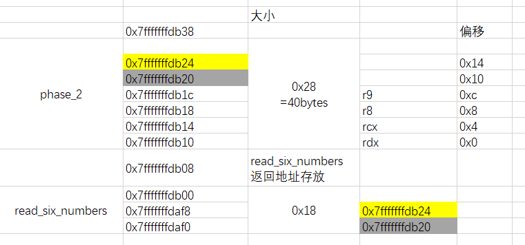
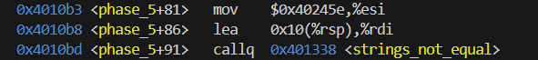
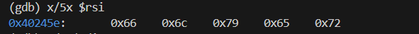
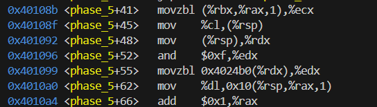
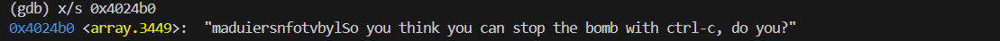
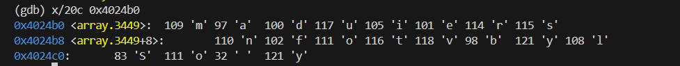
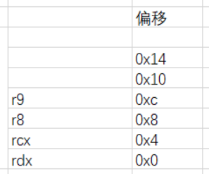

## 概述

该实验给了一个可执行程序，但没有源码，需要利用反汇编，分析汇编代码，依次输入几条正确的字符串，来拆除炸弹。

可以学到的东西有，gdb调试(断点，变量、寄存器、地址空间的查看)，分析汇编语言中函数的参数，分析栈中的数组，分析汇编语言的跳转，递归过程，利用下标取数，链表数据结构

## phase 1 查看phase_1参数

#### 准备

```
objdump -d bomb >bomb.d  #反汇编得到assembly代码
```

查看bomb.c代码，如下：

```
int main(int argc, char *argv[])
{
    char *input;

    /* Note to self: remember to port this bomb to Windows and put a 
     * fantastic GUI on it. */

    /* When run with no arguments, the bomb reads its input lines 
     * from standard input. */
    if (argc == 1) {  
	infile = stdin;
    } 

    /* When run with one argument <file>, the bomb reads from <file> 
     * until EOF, and then switches to standard input. Thus, as you 
     * defuse each phase, you can add its defusing string to <file> and
     * avoid having to retype it. */
    else if (argc == 2) {
	if (!(infile = fopen(argv[1], "r"))) {
	    printf("%s: Error: Couldn't open %s\n", argv[0], argv[1]);
	    exit(8);
	}
    }

    /* You can't call the bomb with more than 1 command line argument. */
    else {
	printf("Usage: %s [<input_file>]\n", argv[0]);
	exit(8);
    }
```

main函数的argc参数允许通过命令行或者gdb输入参数 ；

不输入参数时，argc为1，此时需要通过标准输入stdin读取phase；

输入.txt文件作为参数时，argc为2，从txt文件phase；argc最大为2，main只允许输入一个参数。

从main中可以看到要破解6个phase函数。

#### 开始调试

```as
gdb bomb  #进入调试
layout asm #显示assembly代码
layout reg #显示寄存器值
b main #打断点
b phase1 
i b #显示断点
delete #删除所有断点
delete 1#删除标号为1的断点
r #不输入command line参数 直接执行
c #执行到下一断点
si #单步执行汇编
```

``` ctrl +L #刷新gdb``` 

```r <ans.txt   #输入txt文件 开始执行代码```

进入phase_1之前，会通过read_line函数读取phase，随便输入一个phase,如123，然后去看phase_1的汇编代码如何执行的。

```
0000000000400ee0 <phase_1>:
  400ee0:	48 83 ec 08          	sub    $0x8,%rsp
  400ee4:	be 00 24 40 00       	mov    $0x402400,%esi
  400ee9:	e8 4a 04 00 00       	callq  401338 <strings_not_equal>
  400eee:	85 c0                	test   %eax,%eax
  400ef0:	74 05                	je     400ef7 <phase_1+0x17>                     #strings_not_equal返回0则跳转，不爆炸
  400ef2:	e8 43 05 00 00       	callq  40143a <explode_bomb>
  400ef7:	48 83 c4 08          	add    $0x8,%rsp
  400efb:	c3                   	retq   
```

``x/s  $rdi #rdi存放phase_1参数，x/s以string形式查看rdi``

```
(gdb) x/s $rdi 
0x603780 <input_strings>:       "123"         #可以看到是我们输入的123，而rdi的值为0x603780
(gdb) x/4dx 0x603780                        #查看0x603780处的4个bytes  正好是123的ascii码和结束符00
0x603780 <input_strings>:       0x31    0x32    0x33    0x00            

(gdb) x/dx 0x603780                   #字符串的第一个字符在最低的地址
0x603780 <input_strings>:       0x31
0x603781 <input_strings+1>:     0x32
0x603782 <input_strings+2>:     0x33
0x603783 <input_strings+3>:     0x00
```

继续执行 可以看到phase_1调用了strings_not_equal()，在该函数打个断点，进入后查看其两个参数（分别在rdi和rsi)

```
(gdb) b strings_not_equal
Breakpoint 3 at 0x401338
(gdb) c
Continuing.

Breakpoint 3, 0x0000000000401338 in strings_not_equal ()
(gdb) x/gx $rdi
0x603780 <input_strings>:       "123"
(gdb) x/s $rsi
0x402400:       "Border relations with Canada have never been better."
```

发现phase将0x402400传给了rsi，作为strings_not_equal()的第二个参数

```
0x400ee4 <phase_1+4>    mov    $0x402400,%esi   
```

因此，可以猜测strings_not_equal()比较其两个字符串参数是否相同，不同则返回1，相同则返回0；

猜测"Border relations with Canada have never been better."就是我们需要的第一个phase。


研究一下strings_not_equal()

```assembly
0000000000401338 <strings_not_equal>:                         #注释的->>    -<<是跳转标号
  401338:	41 54                	push   %r12
  40133a:	55                   	push   %rbp
  40133b:	53                   	push   %rbx
  40133c:	48 89 fb             	mov    %rdi,%rbx        #存放rdi
  40133f:	48 89 f5             	mov    %rsi,%rbp          #存放rsi
  401342:	e8 d4 ff ff ff       	callq  40131b <string_length>              #计算rdi的str长度 放入r12d
  401347:	41 89 c4             	mov    %eax,%r12d   
  40134a:	48 89 ef             	mov    %rbp,%rdi
  40134d:	e8 c9 ff ff ff       	callq  40131b <string_length>       #计算rsi的str长度 放入rax
  401352:	ba 01 00 00 00       	mov    $0x1,%edx
  401357:	41 39 c4             	cmp    %eax,%r12d                 
  40135a:	75 3f                	jne    40139b <strings_not_equal+0x63>   #长度不等，则返回1  (0x1->edx->eax)   ->>>4
  40135c:	0f b6 03             	movzbl (%rbx),%eax      #rbx存的rdi 取第一个字符放入eax
  40135f:	84 c0                	test   %al,%al
  401361:	74 25                	je     401388 <strings_not_equal+0x50>     #字符为00，则跳转，并最终返回0   ->>>1
  401363:	3a 45 00             	cmp    0x0(%rbp),%al         #字符不为0 则与rbp的rsi的第一个字符比较
  401366:	74 0a                	je     401372 <strings_not_equal+0x3a>   #相等则继续比较                 ->>>2  
  401368:	eb 25                	jmp    40138f <strings_not_equal+0x57>  #不等则跳转 返回1                ->>>5
  40136a:	3a 45 00             	cmp    0x0(%rbp),%al              #比较下一字符                          -<<<3
  40136d:	0f 1f 00             	nopl   (%rax)
  401370:	75 24                	jne    401396 <strings_not_equal+0x5e>                            #若不等->>>6
  401372:	48 83 c3 01          	add    $0x1,%rbx                  #地址偏移                             -<<<2
  401376:	48 83 c5 01          	add    $0x1,%rbp
  40137a:	0f b6 03             	movzbl (%rbx),%eax
  40137d:	84 c0                	test   %al,%al 
  40137f:	75 e9                	jne    40136a <strings_not_equal+0x32>      #下一字符ascii不为00，则继续   ->>>3     
  401381:	ba 00 00 00 00       	mov    $0x0,%edx
  401386:	eb 13                	jmp    40139b <strings_not_equal+0x63>                                #->>>4                
  401388:	ba 00 00 00 00       	mov    $0x0,%edx                                                      #-<<<1
  40138d:	eb 0c                	jmp    40139b <strings_not_equal+0x63>                                #->>>4   
  40138f:	ba 01 00 00 00       	mov    $0x1,%edx                                                      #-<<<5
  401394:	eb 05                	jmp    40139b <strings_not_equal+0x63>                                #->>>4
  401396:	ba 01 00 00 00       	mov    $0x1,%edx                                                      #-<<<6
  40139b:	89 d0                	mov    %edx,%eax                                                   #-<<<4
  40139d:	5b                   	pop    %rbx
  40139e:	5d                   	pop    %rbp
  40139f:	41 5c                	pop    %r12
  4013a1:	c3                   	retq 
```


## phase 2 栈存数组

#### phase2前半 

```assembly
0000000000400efc <phase_2>:
  400efc:	55                   	push   %rbp
  400efd:	53                   	push   %rbx
  400efe:	48 83 ec 28          	sub    $0x28,%rsp
  400f02:	48 89 e6             	mov    %rsp,%rsi
  400f05:	e8 52 05 00 00       	callq  40145c <read_six_numbers>  
```

随便输入123

#### read_six_numbers

phase_2()调用了read_six_numbers()，并开辟了长为0x28=40bytes的栈区，栈顶作为参数2(rsi)。

进入到read_six_numbers()，可以看到scanf之前rsi中的地址值处理之后赋给了一系列寄存器。



其中0x7fffffffdb20(rsi+0x10)放入了栈区0x7fffffffdaf0（rsp)

0x7fffffffdb24(rsi+0x14)放入了栈区0x7fffffffdaf8（rsp+8)

```assembly
000000000040145c <read_six_numbers>:          #rdi->"123"   rsi "0x7fffffffdb10"
  40145c:	48 83 ec 18          	sub    $0x18,%rsp
  401460:	48 89 f2             	mov    %rsi,%rdx
  401463:	48 8d 4e 04          	lea    0x4(%rsi),%rcx
  401467:	48 8d 46 14          	lea    0x14(%rsi),%rax
  40146b:	48 89 44 24 08       	mov    %rax,0x8(%rsp)
  401470:	48 8d 46 10          	lea    0x10(%rsi),%rax
  401474:	48 89 04 24          	mov    %rax,(%rsp)
  401478:	4c 8d 4e 0c          	lea    0xc(%rsi),%r9
  40147c:	4c 8d 46 08          	lea    0x8(%rsi),%r8
  401480:	be c3 25 40 00       	mov    $0x4025c3,%esi
  401485:	b8 00 00 00 00       	mov    $0x0,%eax    #rdi（输入的字符串） rsi（格式） rdx rcx r8 r9  rsp存两个
  40148a:	e8 61 f7 ff ff       	callq  400bf0 <__isoc99_sscanf@plt>
  40148f:	83 f8 05             	cmp    $0x5,%eax
  401492:	7f 05                	jg     401499 <read_six_numbers+0x3d>
  401494:	e8 a1 ff ff ff       	callq  40143a <explode_bomb>
  401499:	48 83 c4 18          	add    $0x18,%rsp
  40149d:	c3                   	retq   
```

查看<__isoc99_sscanf@plt>的参数rdi rsi 

```
(gdb) x/s $rdi
0x6037d0 <input_strings+80>:    "123"
(gdb) x/s $rsi
0x4025c3:       "%d %d %d %d %d %d"
```

可见phase是6个数，以空格隔开，6个数的存储位置为phase2开辟的栈区（scanf("%d %d %d %d %d %d",&para1,&para2....&para6))

重新运行```r```,尝试输入1 2 3 4 5 6

```assembly
(gdb) b *0x40149d
Breakpoint 6 at 0x40149d
(gdb) x/wd 0x7fffffffdb10            #以decimal查看该地址，正好是输入的1 2 3 4 5 6
0x7fffffffdb10: 1
0x7fffffffdb14: 2
0x7fffffffdb18: 3
0x7fffffffdb1c: 4
0x7fffffffdb20: 5
0x7fffffffdb24: 6
```

#### 继续phase_2

结束read_six_numbers后rsp指向0x7fffffffdb10，即数字1的位置

```assembly
#phase_2后半
  400f05:	e8 52 05 00 00       	callq  40145c <read_six_numbers>
  400f0a:	83 3c 24 01          	cmpl   $0x1,(%rsp)                     #第一个数与1比较 ，不等则爆炸
  400f0e:	74 20                	je     400f30 <phase_2+0x34>           #相等则跳转               ->>1     表示跳到1
  400f10:	e8 25 05 00 00       	callq  40143a <explode_bomb>
  400f15:	eb 19                	jmp    400f30 <phase_2+0x34>
  400f17:	8b 43 fc             	mov    -0x4(%rbx),%eax                 #eax存放rbx之前的一个数，记为pre     #-<<2
  400f1a:	01 c0                	add    %eax,%eax						#pre*=2								
  400f1c:	39 03                	cmp    %eax,(%rbx)						#判断pre==cur	            
  400f1e:	74 05                	je     400f25 <phase_2+0x29>                                  # ->>3 	
  400f20:	e8 15 05 00 00       	callq  40143a <explode_bomb>
  400f25:	48 83 c3 04          	add    $0x4,%rbx                               #继续偏移          -<<3
  400f29:	48 39 eb             	cmp    %rbp,%rbx                               #看偏移后是否为rbp，rbp指向为空，若为rbp则终止
  400f2c:	75 e9                	jne    400f17 <phase_2+0x1b>                                       #->>2
  400f2e:	eb 0c                	jmp    400f3c <phase_2+0x40>                                       #终止->>end
  400f30:	48 8d 5c 24 04       	lea    0x4(%rsp),%rbx                       #偏移rsp得到下一个数      -<<1
  400f35:	48 8d 6c 24 18       	lea    0x18(%rsp),%rbp						#rsp偏移0x18后就没有数了
  400f3a:	eb db                	jmp    400f17 <phase_2+0x1b>                                     #   ->>2
  400f3c:	48 83 c4 28          	add    $0x28,%rsp                                                    #-<<end
  400f40:	5b                   	pop    %rbx
  400f41:	5d                   	pop    %rbp
  400f42:	c3                   	retq  
```

阅读可知 其作用是判断当前数字是否为前一个数字的2倍，若不是，则错误

故phase为1 2 4 8 16 32

## phase 3 跳转

```assembly
0000000000400f43 <phase_3>:
  400f43:	48 83 ec 18          	sub    $0x18,%rsp
  400f47:	48 8d 4c 24 0c       	lea    0xc(%rsp),%rcx                         #num2
  400f4c:	48 8d 54 24 08       	lea    0x8(%rsp),%rdx                         #num1
  400f51:	be cf 25 40 00       	mov    $0x4025cf,%esi
  400f56:	b8 00 00 00 00       	mov    $0x0,%eax                           #scanf("%d,%d",&num1,&num2)
  400f5b:	e8 90 fc ff ff       	callq  400bf0 <__isoc99_sscanf@plt>       #这里break 查看rsi 其指明了phase格式
  400f60:	83 f8 01             	cmp    $0x1,%eax                   #输入大于等于2个数时，rax为1，输入一个数时rax为1
  400f63:	7f 05                	jg     400f6a <phase_3+0x27>                         # ->>1          
  400f65:	e8 d0 04 00 00       	callq  40143a <explode_bomb>
  400f6a:	83 7c 24 08 07       	cmpl   $0x7,0x8(%rsp)                                # -<<1
  400f6f:	77 3c                	ja     400fad <phase_3+0x6a>              #num1 > 7 则爆炸           ->>2
  400f71:	8b 44 24 08          	mov    0x8(%rsp),%eax                     #num1->rax
  400f75:	ff 24 c5 70 24 40 00 	jmpq   *0x402470(,%rax,8)				#以num1做偏移然后跳转，可见0x402470地址的值很重要
  400f7c:	b8 cf 00 00 00       	mov    $0xcf,%eax                      #   rax存放0xcf= 207           -<< num1==0 跳转位置
  400f81:	eb 3b                	jmp    400fbe <phase_3+0x7b>                                         #->> all
  400f83:	b8 c3 02 00 00       	mov    $0x2c3,%eax                     #  rax=0x2c3=707               -<<num2==2
  400f88:	eb 34                	jmp    400fbe <phase_3+0x7b>                                         #->>all   
  400f8a:	b8 00 01 00 00       	mov    $0x100,%eax                     #  rax=0x100                   -<<num2==3
  400f8f:	eb 2d                	jmp    400fbe <phase_3+0x7b>                                         #->>all
  400f91:	b8 85 01 00 00       	mov    $0x185,%eax
  400f96:	eb 26                	jmp    400fbe <phase_3+0x7b>
  400f98:	b8 ce 00 00 00       	mov    $0xce,%eax
  400f9d:	eb 1f                	jmp    400fbe <phase_3+0x7b>
  400f9f:	b8 aa 02 00 00       	mov    $0x2aa,%eax
  400fa4:	eb 18                	jmp    400fbe <phase_3+0x7b>
  400fa6:	b8 47 01 00 00       	mov    $0x147,%eax                                      
  400fab:	eb 11                	jmp    400fbe <phase_3+0x7b>              
  400fad:	e8 88 04 00 00       	callq  40143a <explode_bomb>                                      #-<<2
  400fb2:	b8 00 00 00 00       	mov    $0x0,%eax
  400fb7:	eb 05                	jmp    400fbe <phase_3+0x7b>
  400fb9:	b8 37 01 00 00       	mov    $0x137,%eax                                # rax=0x137=311      -<< num==1 跳转位置
  400fbe:	3b 44 24 0c          	cmp    0xc(%rsp),%eax                       #num2==rax ?            -<< all
  400fc2:	74 05                	je     400fc9 <phase_3+0x86>                               # ->>end
  400fc4:	e8 71 04 00 00       	callq  40143a <explode_bomb>
  400fc9:	48 83 c4 18          	add    $0x18,%rsp                                         #  -<<end
  400fcd:	c3                   	retq  
```

```
(gdb) b *0x400f5b
Breakpoint 8 at 0x400f5b
(gdb) x/s $rdi
0x603820 <input_strings+160>:   "1 10"   #随便输入的1 10
(gdb) x/s $rsi
0x4025cf:       "%d %d"
```

查看rsi知道要输入两个数

查看0x402470，其保存了跳转方向

```
(gdb) x/8gx 0x402470
0x402470:       0x0000000000400f7c      0x0000000000400fb9
0x402480:       0x0000000000400f83      0x0000000000400f8a
0x402490:       0x0000000000400f91      0x0000000000400f98
0x4024a0:       0x0000000000400f9f      0x0000000000400fa6
```

如phase_2注释所示，num1是跳转地址相对0x402470的偏移量，跳转后，对rax赋值，然后判断num2和rax的值是否相等。

因此，有8组答案

0 207

1 311   ...

## phase 4 递归

```assembly
000000000040100c <phase_4>:
  40100c:	48 83 ec 18          	sub    $0x18,%rsp
  401010:	48 8d 4c 24 0c       	lea    0xc(%rsp),%rcx  #num2地址
  401015:	48 8d 54 24 08       	lea    0x8(%rsp),%rdx  #num1地址
  40101a:	be cf 25 40 00       	mov    $0x4025cf,%esi
  40101f:	b8 00 00 00 00       	mov    $0x0,%eax
  401024:	e8 c7 fb ff ff       	callq  400bf0 <__isoc99_sscanf@plt>  #scanf(rdi,rsi,rdx,rcx)
  401029:	83 f8 02             	cmp    $0x2,%eax
  40102c:	75 07                	jne    401035 <phase_4+0x29>
  40102e:	83 7c 24 08 0e       	cmpl   $0xe,0x8(%rsp)        #num1要小于0xe=13
  401033:	76 05                	jbe    40103a <phase_4+0x2e>
  401035:	e8 00 04 00 00       	callq  40143a <explode_bomb>
  40103a:	ba 0e 00 00 00       	mov    $0xe,%edx     
  40103f:	be 00 00 00 00       	mov    $0x0,%esi
  401044:	8b 7c 24 08          	mov    0x8(%rsp),%edi
  401048:	e8 81 ff ff ff       	callq  400fce <func4>         #func4(edi,esi,edx)     3个参数
  40104d:	85 c0                	test   %eax,%eax
  40104f:	75 07                	jne    401058 <phase_4+0x4c>
  401051:	83 7c 24 0c 00       	cmpl   $0x0,0xc(%rsp)           #num2要等于0 才跳转 
  401056:	74 05                	je     40105d <phase_4+0x51>
  401058:	e8 dd 03 00 00       	callq  40143a <explode_bomb>
  40105d:	48 83 c4 18          	add    $0x18,%rsp
  401061:	c3                   	retq   
```

```b *401024```查看```__isoc99_sscanf@plt```参数个数(esi指示了要输入的数的格式)

```
(gdb) x/s $rdi
0x603870 <input_strings+240>:   "1 2"
(gdb) x/s $rsi
0x4025cf:       "%d %d"
```

于是知道该题要输入两个数，若不是两个则explode_bomb；随便输入 1 2。

之后调用了func4  要求func4返回0。

根据``` 401051:	83 7c 24 0c 00       	cmpl   $0x0,0xc(%rsp)``` ，num2显然要为0 根据

func4(num1,0,13)   代码如下： 研究一下num1即可

```assembly
0000000000400fce <func4>:      #3个参数  edi=num1 esi=0 edx=13
  400fce:	48 83 ec 08          	sub    $0x8,%rsp
  400fd2:	89 d0                	mov    %edx,%eax        #edx->eax
  400fd4:	29 f0                	sub    %esi,%eax		#eax=eax-esi=edx-esi
  400fd6:	89 c1                	mov    %eax,%ecx        #ecx=eax
  400fd8:	c1 e9 1f             	shr    $0x1f,%ecx		#ecx=>>31
  400fdb:	01 c8                	add    %ecx,%eax        #eax=ecx+eax
  400fdd:	d1 f8                	sar    %eax             #eax=>>1          综上 eax=((edx-esi)>>31+edx-esi)>>1
  400fdf:	8d 0c 30             	lea    (%rax,%rsi,1),%ecx     #ecx=rax+rsi=((edx-esi)>>31+edx-esi)>>1+esi
  400fe2:	39 f9                	cmp    %edi,%ecx               
  400fe4:	7e 0c                	jle    400ff2 <func4+0x24>           #ecx<=edi        ->>1
  400fe6:	8d 51 ff             	lea    -0x1(%rcx),%edx
  400fe9:	e8 e0 ff ff ff       	callq  400fce <func4>
  400fee:	01 c0                	add    %eax,%eax
  400ff0:	eb 15                	jmp    401007 <func4+0x39>         #return 
  400ff2:	b8 00 00 00 00       	mov    $0x0,%eax                                      #-<<1
  400ff7:	39 f9                	cmp    %edi,%ecx
  400ff9:	7d 0c                	jge    401007 <func4+0x39>         #ecx>=edi return
  400ffb:	8d 71 01             	lea    0x1(%rcx),%esi         
  400ffe:	e8 cb ff ff ff       	callq  400fce <func4>
  401003:	8d 44 00 01          	lea    0x1(%rax,%rax,1),%eax
  401007:	48 83 c4 08          	add    $0x8,%rsp
  40100b:	c3                   	retq   
```

```assembly
ecx<=edi             #   400fe4:	7e 0c                	jle    400ff2 <func4+0x24>  
	ecx>=edi return 0         # 400ff9:	7d 0c                	jge    401007 <func4+0x39>  
	ecx<edi 
		esi=ecx+1
		return 2*func(edi,esi,edx)+1
ecx>edi 
	edx=rcx-1
	return 2*func(edi,esi,edx)                    #  400fe9:	e8 e0 ff ff ff       	callq  400fce <func4>
	
```

易知当ecx==edi时，func4返回0；而```ecx=((edx-esi)>>31+edx-esi)>>1+esi=7```

故答案 7 0

## pahse 5  下标取数

```assembly
0000000000401062 <phase_5>:  #rdi string
  401062:	53                   	push   %rbx      
  401063:	48 83 ec 20          	sub    $0x20,%rsp
  401067:	48 89 fb             	mov    %rdi,%rbx             #rbx保存了rdi
  40106a:	64 48 8b 04 25 28 00 	mov    %fs:0x28,%rax             
  401071:	00 00 
  401073:	48 89 44 24 18       	mov    %rax,0x18(%rsp)
  401078:	31 c0                	xor    %eax,%eax
  40107a:	e8 9c 02 00 00       	callq  40131b <string_length>       #rdi是phase5输入的字符串               
  40107f:	83 f8 06             	cmp    $0x6,%eax         #字符串长度是否为6 不是则错误
  401082:	74 4e                	je     4010d2 <phase_5+0x70>                          #--->>1
  401084:	e8 b1 03 00 00       	callq  40143a <explode_bomb>
  401089:	eb 47                	jmp    4010d2 <phase_5+0x70>
  40108b:	0f b6 0c 03          	movzbl (%rbx,%rax,1),%ecx        #(rax是偏移量) 取rdi的第rax个字符    #-----<<2   
  40108f:	88 0c 24             	mov    %cl,(%rsp)
  401092:	48 8b 14 24          	mov    (%rsp),%rdx
  401096:	83 e2 0f             	and    $0xf,%edx               #取字符值ascii值的后4位  写入edx
  401099:	0f b6 92 b0 24 40 00 	movzbl 0x4024b0(%rdx),%edx      #以0x4024b0作为基址  edx作为偏移  取一个字节存入edx
  4010a0:	88 54 04 10          	mov    %dl,0x10(%rsp,%rax,1)	#把edx中的值写入（%rsp)+0x10+(%rax)的栈处
  4010a4:	48 83 c0 01          	add    $0x1,%rax                #rax加1  知道其为6 依次取出了edi的6个字符
  4010a8:	48 83 f8 06          	cmp    $0x6,%rax
  4010ac:	75 dd                	jne    40108b <phase_5+0x29>                               #----->>2
  4010ae:	c6 44 24 16 00       	movb   $0x0,0x16(%rsp)                
  4010b3:	be 5e 24 40 00       	mov    $0x40245e,%esi
  4010b8:	48 8d 7c 24 10       	lea    0x10(%rsp),%rdi           #(%rsp)+0x10是我们前面构造的字符串的起点 
  4010bd:	e8 76 02 00 00       	callq  401338 <strings_not_equal>
  4010c2:	85 c0                	test   %eax,%eax              
  4010c4:	74 13                	je     4010d9 <phase_5+0x77>       #eax==0   phase_5正常return 
  4010c6:	e8 6f 03 00 00       	callq  40143a <explode_bomb>
  4010cb:	0f 1f 44 00 00       	nopl   0x0(%rax,%rax,1)
  4010d0:	eb 07                	jmp    4010d9 <phase_5+0x77>
  4010d2:	b8 00 00 00 00       	mov    $0x0,%eax                                      #---<<1
  4010d7:	eb b2                	jmp    40108b <phase_5+0x29>                          #------>>2
  4010d9:	48 8b 44 24 18       	mov    0x18(%rsp),%rax
  4010de:	64 48 33 04 25 28 00 	xor    %fs:0x28,%rax
  4010e5:	00 00 
  4010e7:	74 05                	je     4010ee <phase_5+0x8c>
  4010e9:	e8 42 fa ff ff       	callq  400b30 <__stack_chk_fail@plt>
  4010ee:	48 83 c4 20          	add    $0x20,%rsp
  4010f2:	5b                   	pop    %rbx
  4010f3:	c3                   	retq   
```

如下截图 需要```(%rsp)+0x10```处开始的字符串为flyers





​	

找到flyers

而```(%rsp)+0x10```是从下面构造的



```  401099:	0f b6 92 b0 24 40 00 	movzbl 0x4024b0(%rdx),%edx      #以0x4024b0作为基址  edx作为偏移  取一个字节存入edx```




rbx是输入的字符串参数的指针  rax是其下标i 

上述汇编做的运算为取char的后4位，然后作为下标 ， 在“maduier...”中寻找字符



```
flyers在"maduier..."中的下标为：  
f:9   
l:15  需要char字符后四位为f（15）   0x4f->O          
y:14  需要char字符后四位为e（14）   0x4e->N
e:5    0x35->5
r:6 
s 7
```

故答案可以是 9ON567            （不唯一）

## phase 6 node重排

phase6的汇编稍微有点长

首先看到 像phase2一样，要求写入六个数

#### 输入要求 小于等于6且不相同的正数

我们查看一下这段代码

注意rsp存放了我们的6个数 每个数占4个字节

```assembly
  401100:	49 89 e5             	mov    %rsp,%r13          #rsp->r13
  401103:	48 89 e6             	mov    %rsp,%rsi 
  401106:	e8 51 03 00 00       	callq  40145c <read_six_numbers>
  40110b:	49 89 e6             	mov    %rsp,%r14           #rsp->r14
  40110e:	41 bc 00 00 00 00    	mov    $0x0,%r12d			#r12d=0	
  401114:	4c 89 ed             	mov    %r13,%rbp			#r13->rbp             #-<<<4
  401117:	41 8b 45 00          	mov    0x0(%r13),%eax		#rax=(rsp)
  40111b:	83 e8 01             	sub    $0x1,%eax			#rax-1
  40111e:	83 f8 05             	cmp    $0x5,%eax			
  401121:	76 05                	jbe    401128 <phase_6+0x34>	#需要rax<=5      ->>>1
  401123:	e8 12 03 00 00       	callq  40143a <explode_bomb>
  401128:	41 83 c4 01          	add    $0x1,%r12d               #r12d++          -<<<1
  40112c:	41 83 fc 06          	cmp    $0x6,%r12d              
  401130:	74 21                	je     401153 <phase_6+0x5f>     #r12d==6  则跳   ->>>2
  401132:	44 89 e3             	mov    %r12d,%ebx                #rbx用于计算偏移   -<<<3
  401135:	48 63 c3             	movslq %ebx,%rax
  401138:	8b 04 84             	mov    (%rsp,%rax,4),%eax         #rbx*4作为偏移 即取下一个数 
  40113b:	39 45 00             	cmp    %eax,0x0(%rbp)			  #需要下一个数不等于rbp指向的数
  40113e:	75 05                	jne    401145 <phase_6+0x51>
  401140:	e8 f5 02 00 00       	callq  40143a <explode_bomb>
  401145:	83 c3 01             	add    $0x1,%ebx                 #rbx++
  401148:	83 fb 05             	cmp    $0x5,%ebx	
  40114b:	7e e8                	jle    401135 <phase_6+0x41>       #rbx<=5         ->>>3   
  40114d:	49 83 c5 04          	add    $0x4,%r13                   #rbx=6时 r13+4
  401151:	eb c1                	jmp    401114 <phase_6+0x20>                      #->>>4
  401153:	48 8d 74 24 18       	lea    0x18(%rsp),%rsi                              #-<<<2
```

上述代码实现的效果相当于

```c
r13=(%rsp）
for(r12d=1;r12d++;r12d<6){
	if ((r13)-1>5)  explode;
	for(rbx=0;rbx++;rbxx<=5){
		if((r13d+rbx*4)==(r13d))  explode;
	}
}
```

即6个数不能相等 且小于等于6

我们随便输入6 3 2 5 1 4

执行完```│   0x401106 <phase_6+18>   callq  0x40145c <read_six_numbers>  ```之后，查看栈区，正好是我们写入的6的数



```(gdb) x/6wd $rsp
0x7fffffffdab0: 6       3       2       5
0x7fffffffdac0: 1       4
```

#### 继续分析 被7减

查看下面代码

注意r14 rsi此时存的是rsp

```
  401153:	48 8d 74 24 18       	lea    0x18(%rsp),%rsi
  401158:	4c 89 f0             	mov    %r14,%rax
  40115b:	b9 07 00 00 00       	mov    $0x7,%ecx
  401160:	89 ca                	mov    %ecx,%edx
  401162:	2b 10                	sub    (%rax),%edx
  401164:	89 10                	mov    %edx,(%rax)
  401166:	48 83 c0 04          	add    $0x4,%rax
  40116a:	48 39 f0             	cmp    %rsi,%rax
  40116d:	75 f1                	jne    401160 <phase_6+0x6c>
```

易知其效果是：用7减去这6个数 得到新的数

我们的输入为6 3 2 5 1 4 ；此时变成 

```
(gdb) x/6wd $rsp
0x7fffffffdab0: 1       4       5       2
0x7fffffffdac0: 6       3
```

#### 链表重排

继续查看汇编

```assembly
  40116f:	be 00 00 00 00       	mov    $0x0,%esi                                    #rsi用于取输入的数  1 4 5 2 6 3
  401174:	eb 21                	jmp    401197 <phase_6+0xa3>                         #->>>1
  401176:	48 8b 52 08          	mov    0x8(%rdx),%rdx                      #链表跳转 取到下一个node的地址      -<<<3         
  40117a:	83 c0 01             	add    $0x1,%eax                                     #eax++
  40117d:	39 c8                	cmp    %ecx,%eax
  40117f:	75 f5                	jne    401176 <phase_6+0x82>                         #eax!=ecx   直到相等 ->>>3  
  401181:	eb 05                	jmp    401188 <phase_6+0x94>						#->>>>4
  401183:	ba d0 32 60 00       	mov    $0x6032d0,%edx                             #->>>2
  401188:	48 89 54 74 20       	mov    %rdx,0x20(%rsp,%rsi,2)   #edx存了个地址$0x6032d0  将其放入(%rsp)=+20   #-<<<4
  40118d:	48 83 c6 04          	add    $0x4,%rsi                     #rsi+=4
  401191:	48 83 fe 18          	cmp    $0x18,%rsi
  401195:	74 14                	je     4011ab <phase_6+0xb7>
  401197:	8b 0c 34             	mov    (%rsp,%rsi,1),%ecx          #取栈顶rsp处的数放入ecx      -<<<1
  40119a:	83 f9 01             	cmp    $0x1,%ecx                   
  40119d:	7e e4                	jle    401183 <phase_6+0x8f>             #ecx<=1   ->>>2
  40119f:	b8 01 00 00 00       	mov    $0x1,%eax				         								
  4011a4:	ba d0 32 60 00       	mov    $0x6032d0,%edx                 
  4011a9:	eb cb                	jmp    401176 <phase_6+0x82>                      #->>>3
 
```

我们查看一下```x/gx 0x6032d0``，可以看到这是个链表结构体，nodei存放的是值，nodei+8存放的是下一个node的地址。

且其指向是node1->node2->3->4->5->6

```assembly
x/gx 0x6032d0
0x6032d0 <node1>:       0x000000010000014c
0x6032d8 <node1+8>:     0x00000000006032e0     #  &node2
0x6032e0 <node2>:       0x00000002000000a8
0x6032e8 <node2+8>:     0x00000000006032f0
0x6032f0 <node3>:       0x000000030000039c
0x6032f8 <node3+8>:     0x0000000000603300
0x603300 <node4>:       0x00000004000002b3
0x603308 <node4+8>:     0x0000000000603310
0x603310 <node5>:       0x00000005000001dd
0x603318 <node5+8>:     0x0000000000603320
0x603320 <node6>:       0x00000006000001bb
0x603328 <node6+8>:     0x0000000000000000
```

```c
struct node{
	long num;
	node* next;
}
```

而上述汇编的效果是，将nodei的地址按照1 4 5 2 6 3的顺序放入以(%rsp)+0x20开始的栈区。查看一下该栈区

```shell
(gdb) x/gx 0x7fffffffdad0
0x7fffffffdad0: 0x00000000006032d0           #node1
0x7fffffffdad8: 0x0000000000603300           #node4
0x7fffffffdae0: 0x0000000000603310           #node5
0x7fffffffdae8: 0x00000000006032e0          #node2
0x7fffffffdaf0: 0x0000000000603320			#node6
0x7fffffffdaf8: 0x00000000006032f0          #node3
```

继续分析汇编代码

```assembly
  4011ab:	48 8b 5c 24 20       	mov    0x20(%rsp),%rbx     #rbx存放栈区基址rsp+0x20=0x7fffffffdad0处的node地址0x6032d0
  4011b0:	48 8d 44 24 28       	lea    0x28(%rsp),%rax             #rax 是栈区第二个node地址    0x7fffffffdad8
  4011b5:	48 8d 74 24 50       	lea    0x50(%rsp),%rsi             #rsi 存放栈区末尾地址   0x7fffffffdb00      
  4011ba:	48 89 d9             	mov    %rbx,%rcx                   
  4011bd:	48 8b 10             	mov    (%rax),%rdx
  4011c0:	48 89 51 08          	mov    %rdx,0x8(%rcx)             #改变node的指向
  4011c4:	48 83 c0 08          	add    $0x8,%rax
  4011c8:	48 39 f0             	cmp    %rsi,%rax
  4011cb:	74 05                	je     4011d2 <phase_6+0xde>
  4011cd:	48 89 d1             	mov    %rdx,%rcx
  4011d0:	eb eb                	jmp    4011bd <phase_6+0xc9>
```

上述汇编使得 链表重连 1->4->5->2->6->3

```shell
(gdb) x/gx 0x6032d0
0x6032d0 <node1>:       0x000000010000014c
0x6032d8 <node1+8>:     0x0000000000603300       # &node4
0x6032e0 <node2>:       0x00000002000000a8 
0x6032e8 <node2+8>:     0x0000000000603320       
0x6032f0 <node3>:       0x000000030000039c
0x6032f8 <node3+8>:     0x0000000000603300
0x603300 <node4>:       0x00000004000002b3
0x603308 <node4+8>:     0x0000000000603310       # &node5  
0x603310 <node5>:       0x00000005000001dd
0x603318 <node5+8>:     0x00000000006032e0       # &node2
0x603320 <node6>:       0x00000006000001bb
0x603328 <node6+8>:     0x00000000006032f0
```

#### 答案

后续汇编要求重连后node连接由大到小  即node3 4 5 6 1 2（node值由大到小排列）

故输入应数字为4 3 2 1 6 5，其被7减后变为3 4 5 6 1 2 这就是我们需要的node指向
