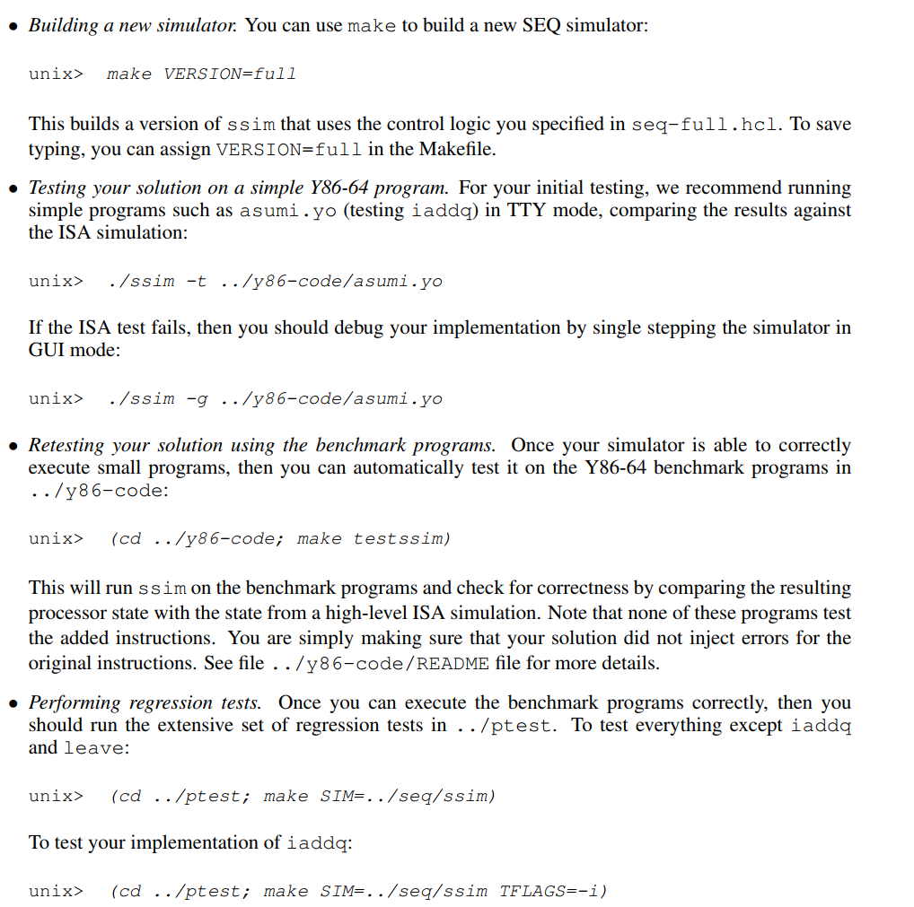
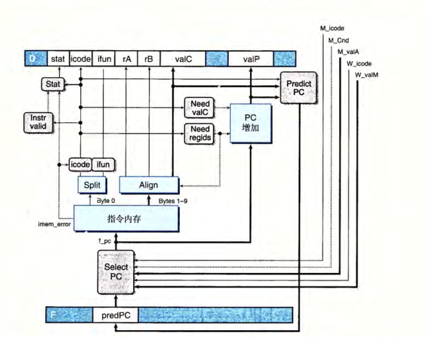

## PartA

用Y86-64的汇编指令，实现三个函数

working in directory sim/misc

链表list简单求和

链表递归求和

数组复制

该汇编和x86-64的功能相似，但更简单，其传递参数、存储局部变量、调用函数、栈帧也类似

```
/* 
 * Architecture Lab: Part A 
 * 
 * High level specs for the functions that the students will rewrite
 * in Y86-64 assembly language
 */

/* $begin examples */
/* linked list element */
typedef struct ELE {
    long val;
    struct ELE *next;
} *list_ptr;

/* sum_list - Sum the elements of a linked list */
long sum_list(list_ptr ls)
{
    long val = 0;
    while (ls) {
	val += ls->val;
	ls = ls->next;
    }
    return val;
}

/* rsum_list - Recursive version of sum_list */
long rsum_list(list_ptr ls)
{
    if (!ls)
	return 0;
    else {
	long val = ls->val;
	long rest = rsum_list(ls->next);
	return val + rest;
    }
}

/* copy_block - Copy src to dest and return xor checksum of src */
long copy_block(long *src, long *dest, long len)
{
    long result = 0;
    while (len > 0) {
	long val = *src++;
	*dest++ = val;
	result ^= val;
	len--;
    }
    return result;
}
/* $end examples */

```

#### sum_list

```
# Sample linked list
    .pos 0
    irmovq stack,%rsp
    call main
    halt

    .align 8
ele1:
    .quad 0x00a
    .quad ele2
ele2:
    .quad 0x0b0
    .quad ele3
ele3:
    .quad 0xc00
    .quad 0

main:
    irmovq ele1,%rdi
    call sum_list
    ret

sum_list:
    irmovq $0,%rax
    irmovq $8,%r8
    andq %rdi,%rdi
    jmp test

loop:
    mrmovq (%rdi),%r10
    addq %r10,%rax
    addq %r8,%rdi
    mrmovq (%rdi),%r10
    rrmovq %r10,%rdi
    andq %rdi,%rdi
    jmp test

test:
    jne loop
    ret

    .pos 0x200
stack:
```

验证：

```
thz@DESKTOP-79OKEST:/mnt/d/cs_basci_labs/CSAPP_labs/my_answer/archlab-handout/sim/misc$ ./yas sum.ys
thz@DESKTOP-79OKEST:/mnt/d/cs_basci_labs/CSAPP_labs/my_answer/archlab-handout/sim/misc$ ./yis sum.yo
Stopped in 36 steps at PC = 0x13.  Status 'HLT', CC Z=1 S=0 O=0
Changes to registers:
%rax:   0x0000000000000000      0x0000000000000cba
%rsp:   0x0000000000000000      0x0000000000000200
%r8:    0x0000000000000000      0x0000000000000008

Changes to memory:
0x01f0: 0x0000000000000000      0x000000000000005b
0x01f8: 0x0000000000000000      0x0000000000000013
```

#### rsum_list

```
# Sample linked list
    .pos 0
    irmovq stack,%rsp
    call main
    halt

    .align 8
ele1:
    .quad 0x00a
    .quad ele2
ele2:
    .quad 0x0b0
    .quad ele3
ele3:
    .quad 0xc00
    .quad 0

main:
    irmovq ele1,%rdi
    call rsum_list
    ret

rsum_list:
    andq %rdi,%rdi
    je if

else:
    pushq %rbx
    mrmovq (%rdi),%rbx
    irmovq $8,%r8
    addq %r8,%rdi
    mrmovq (%rdi),%r8
    rrmovq %r8,%rdi
    call rsum_list
    addq %rbx,%rax
    popq %rbx
    ret

if:
    irmovq $0,%rax
    ret

    .pos 0x2000
stack:
```

```
thz@DESKTOP-79OKEST:/mnt/d/cs_basci_labs/CSAPP_labs/my_answer/archlab-handout/sim/misc$ ./yas rsum.ys
thz@DESKTOP-79OKEST:/mnt/d/cs_basci_labs/CSAPP_labs/my_answer/archlab-handout/sim/misc$ ./yis rsum.yo
Stopped in 46 steps at PC = 0x13.  Status 'HLT', CC Z=0 S=0 O=0
Changes to registers:
%rax:   0x0000000000000000      0x0000000000000cba
%rsp:   0x0000000000000000      0x0000000000002000

Changes to memory:
0x1fc0: 0x0000000000000000      0x0000000000000094
0x1fc8: 0x0000000000000000      0x00000000000000b0
0x1fd0: 0x0000000000000000      0x0000000000000094
0x1fd8: 0x0000000000000000      0x000000000000000a
0x1fe0: 0x0000000000000000      0x0000000000000094
0x1ff0: 0x0000000000000000      0x000000000000005b
0x1ff8: 0x0000000000000000      0x0000000000000013
```

#### copy

```
# Sample linked list
    .pos 0
    irmovq stack,%rsp
    call main
    halt

    .align 8
# Source block
src:
    .quad 0x00a
    .quad 0x0b0
    .quad 0xc00
# Destination block
dest:
    .quad 0x111
    .quad 0x222
    .quad 0x333

main:
    irmovq src,%rdi
    irmovq dest,%rsi
    irmovq $3,%rdx
    irmovq $8,%r9
    call copy_block
    ret

copy_block:
    irmovq $0,%rax
    andq %rdx,%rdx
    je end

loop:
    mrmovq (%rdi),%r8
    xorq %r8,%rax
    rmmovq %r8,(%rsi)
    addq %r9,%rdi
    addq %r9,%rsi
    irmovq $1,%r8
    subq %r8,%rdx
    jne loop

end:
    ret

    .pos 0x2000
stack:


```

```
thz@DESKTOP-79OKEST:/mnt/d/cs_basci_labs/CSAPP_labs/my_answer/archlab-handout/sim/misc$ ./yas copy.ys
thz@DESKTOP-79OKEST:/mnt/d/cs_basci_labs/CSAPP_labs/my_answer/archlab-handout/sim/misc$ ./yis copy.yo
Stopped in 37 steps at PC = 0x13.  Status 'HLT', CC Z=1 S=0 O=0
Changes to registers:
%rax:   0x0000000000000000      0x0000000000000cba
%rsp:   0x0000000000000000      0x0000000000002000
%rsi:   0x0000000000000000      0x0000000000000048
%rdi:   0x0000000000000000      0x0000000000000030
%r8:    0x0000000000000000      0x0000000000000001
%r9:    0x0000000000000000      0x0000000000000008

Changes to memory:
0x0030: 0x0000000000000111      0x000000000000000a
0x0038: 0x0000000000000222      0x00000000000000b0
0x0040: 0x0000000000000333      0x0000000000000c00
0x1ff0: 0x0000000000000000      0x0000000000000079
0x1ff8: 0x0000000000000000      0x0000000000000013
```

==%rax的最终值为0xcba==

## PartB

working in directory sim/seq   

要求：modify the file seq-full.hcl,  extend the SEQ processor to support the iaddq  

### 回顾指令被执行时需要的六个阶段

+ 取指：获取icode:ifun，获取rA:rB，valC，valP
+ 译码：从寄存器文件获取valA,valB
+ 执行：计算得到valE（要么是算数运算 逻辑运算 要么是计算内存地址[rmmovq rA,D(rB)] 要么是计算栈指针）；有时还设置条件码
+ 访存：读（valM）或者是写内存
+ 写回：写寄存器文件
+ 更新PC

#### iaddq 

常数 IADDQ 的声明为C 

```iaddq  V,rB    //编码   C 0 F rB V```

```
//------------取指--------
icode:fun <- M[PC]
rA:rB <- M[PC+1]
valC <- M[PC+2]
valP -<PC+10
//------------译码---------
valB<- R[rB]
//-----------执行---------
valE <- valB+valC
set CC
//------------访存--------
//------------写回--------
R[rB] <- valE
//------------更新PC------
PC <- valP

```

修改hcl文件比较简单，根据iaddq的执行阶段，在特定阶段的HCL语言加上IIADDQ即可

#### 测试 

然后按照下面要求进行测试




## PartC  得分52/60

#### 硬件结构

seq硬件结构如下：

一条指令执行完所有阶段之后，才执行下一条指令


pipe硬件结构如下：

指令执行完一个阶段后，其状态放入下一个状态寄存器，该阶段的硬件交给下一条指令使用


#### Y86-64指令的顺序实现


#### PIPE需要注意的问题

##### PC预测

取指令阶段完成后，下一条指令是谁

大部分指令，pc是valP；jmp和call，pc是valC；

条件转移则需要预测；

ret的PC要在访存阶段之后才知道，策略是暂停处理新指令。

##### 流水线冒险

###### 1，数据冒险

（当下条指令会用到当前指令的结果时；由于寄存器的译码和写回在不同阶段，寄存器会发生数据冒险）

处理策略：

1. 暂停

   即将指令阻塞在当前阶段 （如译码阶段，等前面的指令执行完写回之后，才继续运行），方法是插入一个“bubble”，类似nop指令

   缺点是严重降低了吞吐量

2. 转发 

   将需要的数据直接转发过来，而不是等之前的指令写回

###### 2，转发不能解决 ：加载/使用冒险

​	暂停和转发一起使用，这种方法叫做加载互锁，可以解决加载/使用冒险

​	转发和加载互锁可以解决所有数据冒险

###### 3，控制冒险

（在条件转移和ret时，可能发生控制冒险）

对于ret，其在访存阶段得到valM(PC)，利用bubble暂停后面的指令，等ret访存结束再取指令；

对于jxx，我们默认选择跳转分支，jxx在执行阶段结束后，我们会得到其cond，知道我们预测是否正确；若不正确，则bubble暂停后面的指令，然后取正确地址的指令

#### PIPE实现

##### fetch



```
## What address should instruction be fetched at
# 三个源 预测地址 ret返回的地址 预测错误时，jxx指令的下个地址
word f_pc = [
	# Mispredicted branch.  Fetch at incremented PC
	M_icode == IJXX && !M_Cnd : M_valA;
	# Completion of RET instruction
	W_icode == IRET : W_valM;
	# Default: Use predicted value of PC
	1 : F_predPC;
];

# Predict next value of PC
# 预测地址 两种                                                                                                                                                                                                                                                                           
word f_predPC = [
	f_icode in { IJXX, ICALL } : f_valC;
	1 : f_valP;
];

# Determine status code for fetched instruction
word f_stat = [
	imem_error: SADR;
	!instr_valid : SINS;
	f_icode == IHALT : SHLT;
	1 : SAOK;
];
```

##### decode


```

################ Decode Stage ######################################


## What register should be used as the A source?
word d_srcA = [
	D_icode in { IRRMOVQ, IRMMOVQ, IOPQ, IPUSHQ  } : D_rA;
	D_icode in { IPOPQ, IRET } : RRSP;
	1 : RNONE; # Don't need register
];

## What register should be used as the B source?
word d_srcB = [
	D_icode in { IOPQ, IRMMOVQ, IMRMOVQ  } : D_rB;
	D_icode in { IPUSHQ, IPOPQ, ICALL, IRET } : RRSP;
	1 : RNONE;  # Don't need register
];

## What register should be used as the E destination?
word d_dstE = [
	D_icode in { IRRMOVQ, IIRMOVQ, IOPQ} : D_rB;
	D_icode in { IPUSHQ, IPOPQ, ICALL, IRET } : RRSP;
	1 : RNONE;  # Don't write any register
];

## What register should be used as the M destination?
word d_dstM = [
	D_icode in { IMRMOVQ, IPOPQ } : D_rA;
	1 : RNONE;  # Don't write any register
];


# 下面的转发逻辑比较麻烦
## What should be the A value?
## Forward into decode stage for valA
word d_valA = [
	D_icode in { ICALL, IJXX } : D_valP; # Use incremented PC    #select 合并信号valA和valP
	d_srcA == e_dstE : e_valE;    # Forward valE from execute
	d_srcA == M_dstM : m_valM;    # Forward valM from memory
	d_srcA == M_dstE : M_valE;    # Forward valE from memory
	d_srcA == W_dstM : W_valM;    # Forward valM from write back
	d_srcA == W_dstE : W_valE;    # Forward valE from write back
	1 : d_rvalA;  # Use value read from register file
];

word d_valB = [
	d_srcB == e_dstE : e_valE;    # Forward valE from execute
	d_srcB == M_dstM : m_valM;    # Forward valM from memory
	d_srcB == M_dstE : M_valE;    # Forward valE from memory
	d_srcB == W_dstM : W_valM;    # Forward valM from write back
	d_srcB == W_dstE : W_valE;    # Forward valE from write back
	1 : d_rvalB;  # Use value read from register file       先考虑上面是否需要转发 如果不涉及转发 则取d_rvalB
];
```

##### 其他阶段比较简单

#### PIPE流水线控制逻辑

主要是解决下面几个问题：

1. 加载/使用冒险：使用加载互锁解决
2. ret：流水线暂停直至ret写回
3. 处理错误的PC预测（jxx） ：取消错误指令，从正确的位置取指
4. 异常处理：暂停cnd等程序员可见状态的更新，错误指令写回后，停止执行；期望的结果是，异常指令之前的指令都完成了，异常指令之后的指令不改变程序员可见状态

==上述问题的触发条件，如何设置转发、暂停和bubble==


### 正式进入PartC 

working directory ：sim/pipe

modify : ncopy.ys & pipe-full.hcl 

purpose: run fast   CPE指的是 复制每个单元需要的时钟周期   eg:   897 cycles to copy 63 elements, for a CPE of 897=63 = 14:24.  

测试时，先用pipe简单测试两个driver文件 ；然后用simulator（不是我们的PIPE，而是他们的yis）和更多程序测试ncopy.yo的正确性； 然后测试pipe simulator的正确性

#### 不改动 测试一下 (编译错误)

```shell
thz@DESKTOP-79OKEST:/mnt/d/cs_basci_labs/CSAPP_labs$ cd my_answer/archlab-handout/sim/pipe/
thz@DESKTOP-79OKEST:/mnt/d/cs_basci_labs/CSAPP_labs/my_answer/archlab-handout/sim/pipe$ make VERSION=full
# Building the pipe-full.hcl version of PIPE
../misc/hcl2c -n pipe-full.hcl < pipe-full.hcl > pipe-full.c
gcc -Wall -O2 -isystem /usr/include/tcl8.5 -I../misc -DHAS_GUI -o psim psim.c pipe-full.c \
        ../misc/isa.c -L/usr/lib -ltk -ltcl -lm
psim.c:23:10: fatal error: tk.h: No such file or directory
   23 | #include <tk.h>
      |          ^~~~~~
compilation terminated.
make: *** [Makefile:44: psim] Error 1
```

对makefile进行修改 

注释掉pipe/psim的

之后编译成功

1. 先用pipe测试 sdriver.yo和ldriver.yo

```
>   ./psim -t sdriver.yo                 //-t是直接测试 -g是gui模式
 
```

结果是


```
ISA Check Succeeds
CPI: 73 cycles/58 instructions = 1.26
```

2. 然后用更多程序测试nocopy.yo

```shell

 > ../misc/yis sdriver.yo                 //两个小测试
 > ../misc/yis ldriver.yo
 
 //更多参数下的测试
thz@DESKTOP-79OKEST:/mnt/d/cs_basci_labs/CSAPP_labs/my_answer/archlab-handout/sim/pipe$ ./correctness.pl 
Simulating with instruction set simulator yis
        ncopy
0       OK
1       OK
2       OK
3       OK
...
```

3. 然后测试pipe simulator

   ```
   >cd ../y86-code/              #对若干程序进行测试
   >make testpsim
   >cd ../ptest; make SIM=../pipe/psim TFLAGS=-i           //对指令集测试  -i 表示包含iaddq
   
   thz@DESKTOP-79OKEST:/mnt/d/cs_basci_labs/CSAPP_labs/my_answer/archlab-handout/sim/ptest$ make SIM=../pipe/psim 
   ./optest.pl -s ../pipe/psim 
   Simulating with ../pipe/psim
     All 49 ISA Checks Succeed
   ./jtest.pl -s ../pipe/psim 
   Simulating with ../pipe/psim
     All 64 ISA Checks Succeed
   ./ctest.pl -s ../pipe/psim 
   Simulating with ../pipe/psim
     All 22 ISA Checks Succeed
   ./htest.pl -s ../pipe/psim 
   Simulating with ../pipe/psim
     All 600 ISA Checks Succeed
     
   > cd ../pipe; ./correctness.pl -p          #对ncopy进行若干参数的测试
   ```

   计算得分 平均CPI

   ```
   thz@DESKTOP-79OKEST:/mnt/d/cs_basci_labs/CSAPP_labs/my_answer/archlab-handout/sim/pipe$ ./benchmark.pl 
           ncopy
   0       13
   ...
   64      913     14.27
   Average CPE     15.18
   Score   0.0/60.0
   ```

#### 开始优化

##### 实现iaddq

仿照seq-full.hcl，修改pipi-full.hcl即可

```
# 检测pipe正确性
make psim VERSION=full
./psim -t sdriver.yo
cd ../ptest/
make SIM=../pipe/psim  
make SIM=../pipe/psim  TFLAGS=-i
```

结果


##### 利用iaddq

修改ncopy.ys 利用上iaddq

```
######################原代码##############################
# You can modify this portion
	# Loop header
	xorq %rax,%rax		# count = 0;
	andq %rdx,%rdx		# len <= 0?
	jle Done		# if so, goto Done:

Loop:	
	mrmovq (%rdi), %r10	# read val from src...   此处加载/使用冒险
	rmmovq %r10, (%rsi)	# ...and store it to dst
	andq %r10, %r10		# val <= 0?
	jle Npos		# if so, goto Npos:
	irmovq $1, %r10                       #此处可用iaddq
	addq %r10, %rax		# count++
Npos:	
	irmovq $1, %r10        
	subq %r10, %rdx		# len--      加载/使用冒险
	irmovq $8, %r10            #加载使用冒险
	addq %r10, %rdi		# src++
	addq %r10, %rsi		# dst++
	andq %rdx,%rdx		# len > 0?
	jg Loop			# if so, goto Loop:
##################################################################
# Do not modify the following section of code
# Function epilogue.
Done:
	ret
	
```

利用iaddq并消除加载/使用冒险

```
##################################################################
# You can modify this portion
	# Loop header
	xorq %rax,%rax		# count = 0;
	andq %rdx,%rdx		# len <= 0?
	jle Done		# if so, goto Done:
Loop:	
	mrmovq (%rdi), %r10	# read val from src...
    iaddq $-1,%rdx		# len--      消除加载/使用冒险
	rmmovq %r10, (%rsi)	# ...and store it to dst
	iaddq $8, %rdi		# src++
	iaddq $8, %rsi		# dst++
	andq %r10, %r10		# val <= 0?
	jle Npos		# if so, goto Npos:
	iaddq $1,%rax
Npos:	
	andq %rdx,%rdx		# len > 0?
	jg Loop			# if so, goto Loop:
```

结果


##### 循环展开

```c
// 原代码
word_t ncopy(word_t *src, word_t *dst, word_t len)
{
    word_t count = 0;
    word_t val;

    while (len > 0) {
	val = *src++;
	*dst++ = val;
	if (val > 0)
	    count++;
	len--;
    }
    return count;
}
// 2x1循环
while(len>=2){
    val = *src++;
	*dst++ = val;
    if (val > 0)
	    count++;
    val = *src++;
	*dst++ = val;
	 if (val > 0)
	    count++;
    len-=2;
}
//len<2
for(i=0;i<len;i++){
    val = *src++;
	*dst++ = val;
    if (val > 0)
	    count++;
}
//三路类似

```

```
//五路展开 ys代码
##################################################################
# You can modify this portion
	# Loop header
	xorq %rax,%rax		# count = 0;
	andq %rdx,%rdx		# len <=0 ?

Test1:
	iaddq $-5,%rdx		# k路循环展开 是否大于等于k ?
	jge Loop1
	iaddq $5, %rdx
	jg Loop           
	jmp Done       # len <=0 ? Done


Loop:              # len不够k  普通循环
	mrmovq (%rdi), %r10	# read val from src...   
	iaddq $8, %rdi		# src++
	rmmovq %r10, (%rsi)	# ...and store it to dst
	iaddq $8, %rsi		# dst++
	iaddq $-1,%rdx
	andq %r10, %r10		# val <= 0?
	jle RET1		# if so, goto Npos:
	iaddq $1,%rax

RET1:
	andq %rdx,%rdx		# len > 0?
	jg Loop			# if so, goto Loop:
	ret

Loop1:	
	mrmovq (%rdi), %r10	# read val from src...   
	iaddq $8, %rdi		# src++
	rmmovq %r10, (%rsi)	# ...and store it to dst
	iaddq $8, %rsi		# dst++
	andq %r10, %r10		# val <= 0?
	jle Loop2		# if so, goto Npos:
	iaddq $1,%rax
Loop2:	
	mrmovq (%rdi), %r10	# read val from src...   
	iaddq $8, %rdi		# src++
	rmmovq %r10, (%rsi)	# ...and store it to dst
	iaddq $8, %rsi		# dst++
	andq %r10, %r10		# val <= 0?
	jle Loop3		# if so, goto Npos:
	iaddq $1,%rax
Loop3:	
	mrmovq (%rdi), %r10	# read val from src...   
	iaddq $8, %rdi		# src++
	rmmovq %r10, (%rsi)	# ...and store it to dst
	iaddq $8, %rsi		# dst++
	andq %r10, %r10		# val <= 0?
	jle Loop4		# if so, goto Npos:
	iaddq $1,%rax
Loop4:	
	mrmovq (%rdi), %r10	# read val from src...   
	iaddq $8, %rdi		# src++
	rmmovq %r10, (%rsi)	# ...and store it to dst
	iaddq $8, %rsi		# dst++
	andq %r10, %r10		# val <= 0?
	jle Loop5		# if so, goto Npos:
	iaddq $1,%rax
Loop5:
	mrmovq (%rdi), %r10	# read val from src...   
	iaddq $8, %rdi		# src++
	rmmovq %r10, (%rsi)	# ...and store it to dst
	iaddq $8, %rsi		# dst++
	andq %r10, %r10		# val <= 0?
	jle Test1		# if so, goto Npos:
	iaddq $1,%rax
	jmp Test1

```

得分情况

```
五路
Average CPE     9.77
Score   14.5/60.0
六路
Average CPE     9.76
Score   14.7/60.0
```

##### 精简指令

```
主要是精简了loop
Loop1:	
	mrmovq (%rdi), %r10	# read val from src...   
	rmmovq %r10, (%rsi)	# ...and store it to dst
	andq %r10, %r10		# val <= 0?
	jle Loop2		# if so, goto Npos:
	iaddq $1,%rax
Loop2:	
	mrmovq 8(%rdi), %r10	# read val from src...   
	rmmovq %r10, 8(%rsi)	# ...and store it to dst
	andq %r10, %r10		# val <= 0?
	jle Loop3		# if so, goto Npos:
	iaddq $1,%rax
Loop3:	
	mrmovq 16(%rdi), %r10	# read val from src...   
	rmmovq %r10, 16(%rsi)	# ...and store it to dst
	andq %r10, %r10		# val <= 0?
	jle Loop4		# if so, goto Npos:
	iaddq $1,%rax
Loop4:	
	mrmovq 24(%rdi), %r10	# read val from src...   
	rmmovq %r10, 24(%rsi)	# ...and store it to dst
	andq %r10, %r10		# val <= 0?
	jle Loop5		# if so, goto Npos:
	iaddq $1,%rax
Loop5:	
	mrmovq 32(%rdi), %r10	# read val from src...   
	rmmovq %r10, 32(%rsi)	# ...and store it to dst
	andq %r10, %r10		# val <= 0?
	jle Loop6		# if so, goto Npos:
	iaddq $1,%rax
Loop6:
	mrmovq 40(%rdi), %r10	# read val from src...   
	rmmovq %r10, 40(%rsi)	# ...and store it to dst
	iaddq $48,%rdi
	iaddq $48,%rsi
	andq %r10, %r10		# val <= 0?
	jle Test1		# if so, goto Npos:
	iaddq $1,%rax
	jmp Test1
```

```
Average CPE     9.22
Score   25.5/60.0
```


##### 消除气泡

```
##################################################################
# You can modify this portion
	# Loop header
	# xorq %rax,%rax		# count = 0; 不需要初始化 rax本来就是0
	jmp Test1

Loop:              # len不够k  普通循环
	mrmovq (%rdi), %r10	# read val from src...   
	iaddq $8, %rdi		# src++
	rmmovq %r10, (%rsi)	# ...and store it to dst
	iaddq $8, %rsi		# dst++
	iaddq $-1,%rdx
	andq %r10, %r10		# val <= 0?
	jle RET1		# if so, goto Npos:
	iaddq $1,%rax
RET1:
	andq %rdx,%rdx		# len > 0?
	jg Loop			# if so, goto Loop:
	ret

#循环展开
Loop1:	
	mrmovq (%rdi), %r10	# read val from src...                   #消除气泡 引入额外的寄存器
	mrmovq 8(%rdi),%r9  
	rmmovq %r10, (%rsi)	# ...and store it to dst
	rmmovq %r9, 8(%rsi)
	andq %r10, %r10		# val <= 0?
	jle Loop2		# if so, goto Npos:
	iaddq $1,%rax
Loop2:	
	andq %r9, %r9		# val <= 0?
	jle Loop3		# if so, goto Npos:
	iaddq $1,%rax
Loop3:	
	mrmovq 16(%rdi), %r10	# read val from src...   
	mrmovq 24(%rdi),%r9  
	rmmovq %r10, 16(%rsi)	# ...and store it to dst
	rmmovq %r9, 24(%rsi)
	andq %r10, %r10		# val <= 0?
	jle Loop4		# if so, goto Npos:
	iaddq $1,%rax
Loop4:	
	andq %r9, %r9		# val <= 0?
	jle Loop5		# if so, goto Npos:
	iaddq $1,%rax
Loop5:	
	mrmovq 32(%rdi), %r10	# read val from src...  
	mrmovq 40(%rdi),%r9   
	rmmovq %r10, 32(%rsi)	# ...and store it to dst
	rmmovq %r9, 40(%rsi)
	andq %r10, %r10		# val <= 0?
	jle Loop6		# if so, goto Npos:
	iaddq $1,%rax
Loop6:
	iaddq $48,%rdi
	iaddq $48,%rsi
	andq %r9, %r9		# val <= 0?
	jle Test1		# if so, goto Npos:
	iaddq $1,%rax

Test1:                       #循环展开的判断		
	iaddq $-6,%rdx
	jge Loop1   # len>=k  k路循环展开
	iaddq $6,%rdx
	jg Loop 
	jle Done
```

```
Average CPE     8.24
Score   45.2/60.0
```

##### 剩余数据处理

6路循环时 剩余数据的情况是0 1 2 3 4 5

先分为大于等于3个 和小于3个 

对于大于等于3：  3路循环

小于3个： 分三种情况处理

 ```
 ##################################################################
 # You can modify this portion
 	# Loop header
 	# xorq %rax,%rax		# count = 0; 不需要初始化 rax本来就是0
 	jmp Test1
 
 
 #循环展开
 Loop1:	
 	mrmovq (%rdi), %r10	# read val from src... 
 	mrmovq 8(%rdi),%r9  
 	rmmovq %r10, (%rsi)	# ...and store it to dst
 	rmmovq %r9, 8(%rsi)
 	andq %r10, %r10		# val <= 0?
 	jle Loop2		
 	iaddq $1,%rax
 Loop2:	
 	andq %r9, %r9		# val <= 0?
 	jle Loop3		
 	iaddq $1,%rax
 Loop3:	
 	mrmovq 16(%rdi), %r10	# read val from src...   
 	mrmovq 24(%rdi),%r9  
 	rmmovq %r10, 16(%rsi)	# ...and store it to dst
 	rmmovq %r9, 24(%rsi)
 	andq %r10, %r10		# val <= 0?
 	jle Loop4	
 	iaddq $1,%rax
 Loop4:	
 	andq %r9, %r9		# val <= 0?
 	jle Loop5		
 	iaddq $1,%rax
 Loop5:	
 	mrmovq 32(%rdi), %r10	# read val from src...  
 	mrmovq 40(%rdi),%r9   
 	rmmovq %r10, 32(%rsi)	# ...and store it to dst
 	rmmovq %r9, 40(%rsi)
 	andq %r10, %r10		# val <= 0?
 	jle Loop6		
 	iaddq $1,%rax
 Loop6:
 	iaddq $48,%rdi
 	iaddq $48,%rsi
 	andq %r9, %r9		# val <= 0?
 	jle Test1		
 	iaddq $1,%rax
 
 Test1:                       #循环展开的判断		
 	iaddq $-6,%rdx
 	jge Loop1   # len>=k  k路循环展开
 
 # rdx: 0 1 2 |  3 4 5
 #-6 : -6 -5 -4 -3 -2 -1  Test
 #+3 : -3 -2 -1 0 1 2    Remain
 Remain:       #二分 len<k
 	iaddq $3,%rdx           #len-6+3>=0 -> len>=3
 	jge Right       #len>=3?               
 
 # -3 -2 -1
 # +2 : -1 0 1
 Left:      # len<=2 
 	iaddq $2,%rdx       
 	jl Done               #len==0
 	je L1            	#len==1
 	jg L2				# len==2 ?
 
 L1:        #len==1
 	mrmovq (%rdi),%r8
 	rmmovq %r8,(%rsi)
 	andq %r8,%r8    # val <= 0?
 	jle Done		  
 	iaddq $1,%rax
 	ret
 L2:    #len==2
 	mrmovq (%rdi),%r8
 	mrmovq 8(%rdi),%r9
 	rmmovq %r8,(%rsi)
 	rmmovq %r9,8(%rsi)
 	andq %r8,%r8    # val <= 0?
 	jle L21		  
 	iaddq $1,%rax
 L21: andq %r9,%r9
 	jle Done		 
 	iaddq $1,%rax
 	ret
 
 Right:     #len>=3
 	mrmovq (%rdi),%r8
 	mrmovq 8(%rdi),%r9
 	mrmovq 16(%rdi),%r10
 	rmmovq %r8,(%rsi)
 	rmmovq %r9,8(%rsi)
 	rmmovq %r10,16(%rsi)
 	iaddq $24,%rdi
 	iaddq $24,%rsi
 	iaddq $-3,%rdx 
 	andq %r8,%r8    # val <= 0?
 	jle R1		   # if so, goto Npos:
 	iaddq $1,%rax
 R1: andq %r9,%r9
 	jle R2		  # if so, goto Npos:
 	iaddq $1,%rax
 R2: andq %r10,%r10
 	jle Left		 # if so, goto Npos:
 	iaddq $1,%rax
 	jmp Left
 ```


```
Average CPE     7.86
Score   52.8/60.0
```


## 参考

[CSAPP | Lab4-Architecture Lab 深入解析 - 知乎 (zhihu.com)](https://zhuanlan.zhihu.com/p/480380496)

[通俗解说CSAPP的archlab partC - 知乎 (zhihu.com)](https://zhuanlan.zhihu.com/p/61151313)
