## PART A 模拟cache

### hints

* 从小的做起  traces/dave.trace
* 实现参数 -v 显示每次内存访问(memory access)的结果(hit miss eviction)，便于debug
* 使用getopt函数 解析命令行参数 `man 3 getopt`
* L(load) S(store)可导致最多一次miss 而M(modify)相当于一次load和同地址store，可导致2次hit，或1个miss和1个hit(可能还多一个eviction)
* 使用malloc函数，对任意s、E、b参数进行模拟
* 忽略I(instruction cache access)
* 默认内存访问时数据对齐的

### 要求

编写csim.c  得到和`csim-ref`得到相同的结果，csim-ref采用LRU替换策略（替换访问时间最久远的块）

### 知识点

#### cache结构

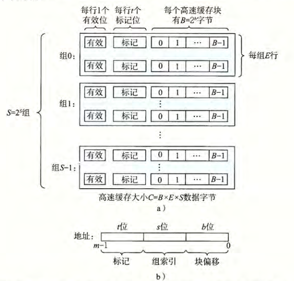
$$
共S=2^s组(cacheset)，每组E个高速缓存行(cacheline) ，每行的B=2^b个字节，称为B字节的数据块（block)
$$
每行有一个数据块，还一些标记位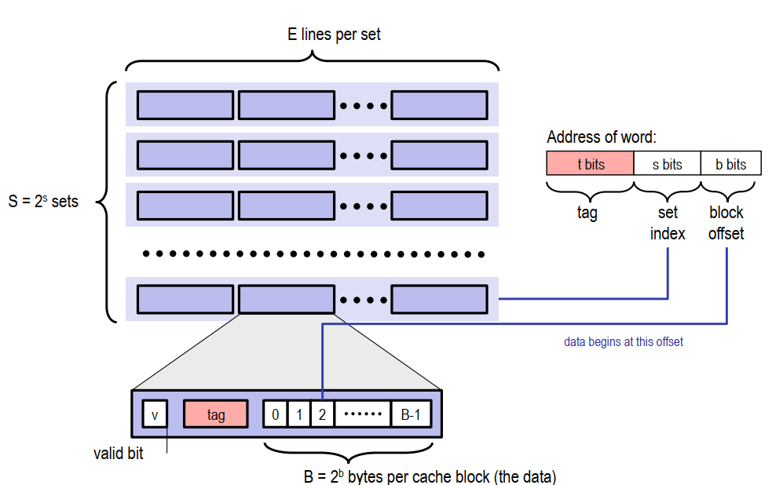

cache的结构是S*E个block，使用四元组（S，E，b，m）可确定一个cache；

数据总是以块为单位在层与层之间传递，当某个地址不命中时，该地址所在的块都会被存储到高一级的缓存中

在缓存中，每个行除了块之外，还有t位的标记位和额外的有效位

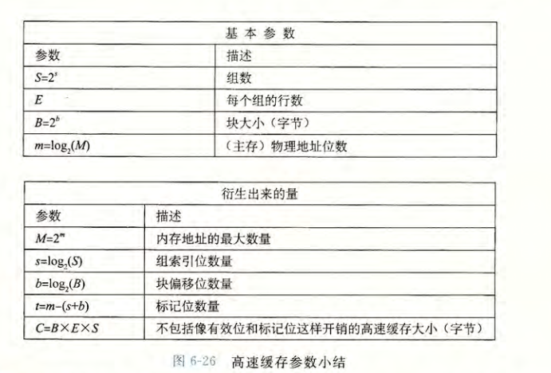

#### cache的块是如何查找定位的

==如何确定给定地址的字（ 64位机字长64位，即一次取出64位的数据进行处理）是否在高速缓存中呢？==

m位地址被参数S和B分为三段，其中s位的组索引和b位的块偏移由上图可以理解，对于一片连续的内存，如果其t和s位相同，则会被放入同一个块中。也即，若块的的大小为B，则连续的大小为B的内存会被放入同一块中。

问题是一个组可能有多个行，如何确定该字在哪一行呢：利用标记位t来确定。当cache中对应组的标记位和地址中标记为相同时，即为命中；若不命中，则需要替换cache在该组的某一行的块；具体替换哪一行由替换策略决定

### 编写csim.c

```
Usage: ./csim-ref [-hv] -s <s> -E <E> -b <b> -t <tracefile>
• -h: Optional help flag that prints usage info
• -v: Optional verbose flag that displays trace info
• -s <s>: Number of set index bits (S = 2s is the number of sets)
• -E <E>: Associativity (number of lines per set)
• -b <b>: Number of block bits (B = 2b is the block size)
• -t <tracefile>: Name of the valgrind trace to replay
```

#### 代码如下

* 主要是getopt实现命令解析

* 逐行处理trace文件，并提取地址，计算其标志位，组索引

* 模拟一个随着内存访问次数增多而变大的时间变量，用于实现LRU替换

* 模拟hit miss eviction的过程，在malloc申请的空间中查询cache的块匹配情况

```c
#define _XOPEN_SOURCE
#include <unistd.h>
#include <getopt.h>
#include <stdio.h>
#include <stdlib.h>
#include <string.h>
#include <malloc.h>
#include "cachelab.h"

#define MAX_SIZE 1024
int char2int(char c);
int main(int argc,char* argv[])
{
    int s=0,E=0,b=0;
    int debug=0;
    int S=0;
    //int B=0;
    char *trace_file;
    char *usage="Usage: ./csim [-hv] -s <s> -E <E> -b <b> -t <tracefile> \n\
                -h: Optional help flag that prints usage info \n\
                -v: Optional verbose flag that displays trace info \n\
                -s <s>: Number of set index bits (S = 2s is the number of sets) \n\
                -E <E>: Associativity (number of lines per set) \n\
                -b <b>: Number of block bits (B = 2b is the block size) \n\
                -t <tracefile>: Name of the valgrind trace to replay\n" ;
    //解析命令
    //加冒号的是必选 getopt自带全局变量optarg
    int opt=0;
    while((opt=getopt(argc,argv,"hvs:E:b:t:"))!=-1){
        switch (opt)
        {
        case 'h':
            printf("%s",usage);
            break;
        case 'v':
            debug=1;
            break;
        case 's':
            s=atoi(optarg);
            S=1<<s;
            break;
        case 'E':
            E=atoi(optarg);
            break;
        case 'b':
            b=atoi(optarg);
            //B=1<<b;
            break;
        case 't':
            trace_file=optarg;
            break;
        default:
            break;
        }
    }

    //申请cache空间  cache是一个S*E个缓存行（每个缓存行包含一个块及有效位 标记位 )
    typedef struct  cache_line_{
        int valid;   //有效位
        __uint64_t tag;   //标记位
        int last_access_time;  //为了LRU设置的访问时间记录
    }cache_line;

    cache_line *cache=(cache_line*)malloc(sizeof(cache_line)*S*E);
    for(int i=0;i<S*E;i++){
        cache[i].valid=0;
        cache[i].tag=0;
        cache[i].last_access_time=0;
    }


    FILE *fp=fopen(trace_file,"r");
    char line_of_trace[MAX_SIZE];
    int time_count=0;  //记录时间 每access一次内存 时间+1  时间越小 说明越久远
    //逐行处理trace

    int hit=0;
    int miss=0;
    int eviction=0;
    while(fgets(line_of_trace,MAX_SIZE,fp)){
        //分割每一行，提取address
        __uint64_t address=0;  
        //int size=0;    
        int access_count=0;

        int str_len=strlen(line_of_trace);
        char single_char;
        for(int i=0;i<str_len-1;i++){
            single_char=line_of_trace[i];
            if(single_char=='I')
                break;
            else if(single_char=='L'||single_char=='S')
                access_count=1;
            else if(single_char=='M')
                access_count=2;
            else if(single_char==' ')
                continue;
            else if(single_char==','){
                //size=line_of_trace[i+1]-'0';
                break;
            }
            else {
                address=address*16+char2int(single_char);
            }
        }
        if(debug&&access_count!=0) printf("%s",line_of_trace);

        if(access_count==0) continue;
        //printf("access time:%d,adr:%d,size:%d\n",access_count,address,size);
    
        //模拟内存访问 对于L，S只访问一次
        //对于M,则访问两次，且不论第一次结果如何，第二次必然hit
        time_count++;   //每次访问 时间递增
        
        //计算标记位 组索引；
        int m=64;  //地址64位
        __uint64_t tag=address>>(s+b);   //标记位
        __uint64_t S_index=(address<<(m-s-b))>>(m-s);  //组索引
        //__uint64_t block_offset=(address<<(m-b))>>(m-b);   //块偏移
        // printf("tag: %lx ,",tag);
        // printf("S_index:%lx ,",S_index);
        // printf("block_offset:%lx\n",block_offset);

        int hit_flag=0;
        int get_free_cache=0;
        if(access_count>=1){
            int cache_idx_st=S_index*E;  //cache的S_index组的起点偏移
            //查询该组的缓存行
            //查询是否hit
            for(int i=0;i<E;i++){   
                if(cache[cache_idx_st+i].valid==1&& \
                    cache[cache_idx_st+i].tag==tag){
                    hit++;
                    hit_flag=1;
                    cache[cache_idx_st+i].last_access_time=time_count; //记得更新时间
                    break;
                }
            }
            if(hit_flag&&debug)  printf(" hit");

            //未hit 查询是否有空cache_line
            if(!hit_flag){
                miss++;
                if(debug) printf(" miss");
                for(int i=0;i<E;i++){   
                if(cache[cache_idx_st+i].valid==0){
                    cache[cache_idx_st+i].valid=1;
                    cache[cache_idx_st+i].tag=tag;
                    cache[cache_idx_st+i].last_access_time=time_count;
                    get_free_cache=1;
                    break;
                    }
                }
            }
           
            //cache满了且miss 
            if(!get_free_cache&&!hit_flag){
                unsigned int evic_idx=0,min_time_count=0xffffffff;
                //找出last_access_time最小了 即上次访问最久远的 将其替换
                for(int i=0;i<E;i++){
                    if(cache[cache_idx_st+i].last_access_time<min_time_count){
                        min_time_count=cache[cache_idx_st+i].last_access_time;
                        evic_idx=i;
                    }
                }
                cache[cache_idx_st+evic_idx].tag=tag;
                cache[cache_idx_st+evic_idx].last_access_time=time_count;
                cache[cache_idx_st+evic_idx].valid=1;
                eviction++;
                if(debug) printf(" eviction"); 
            }

            if(access_count==2) {
                if(debug) printf(" hit");
                hit++;
                time_count++;
            }
        }
        if(debug) printf("\n");
    }
    //printf("\nhit:%d,miss:%d,eviction:%d\n",hit,miss,eviction);
    printSummary(hit,miss,eviction);
    return 0;
}

int char2int(char c){
    if(c<='9'&&c>='0')
        return c-'0';
    else if(c<='f'&&c>='a')
        return c-'a'+10;
    return 0;
}

```

测试结果：

```shell
                        Your simulator     Reference simulator
Points (s,E,b)    Hits  Misses  Evicts    Hits  Misses  Evicts
     3 (1,1,1)       9       8       6       9       8       6  traces/yi2.trace
     3 (4,2,4)       4       5       2       4       5       2  traces/yi.trace
     3 (2,1,4)       2       3       1       2       3       1  traces/dave.trace
     3 (2,1,3)     167      71      67     167      71      67  traces/trans.trace
     3 (2,2,3)     201      37      29     201      37      29  traces/trans.trace
     3 (2,4,3)     212      26      10     212      26      10  traces/trans.trace
     3 (5,1,5)     231       7       0     231       7       0  traces/trans.trace
     6 (5,1,5)  265189   21775   21743  265189   21775   21743  traces/long.trace
    27

TEST_CSIM_RESULTS=27
```

## PART B 优化矩阵转置

编写tran.c，使得cachde的miss越少越好。具体而言是编写函数transpose_submit

#### 提示

Valgrind是一个GPL（一种开源协议）的软件，用于Linux（For x86, amd64 and ppc32）程序的内存调试和代码剖析。

需要下载好valgrind

```
使用下面的矩阵进行测试 ;
• 32 × 32: 8 points if m < 300, 0 points if m > 600
• 64 × 64: 8 points if m < 1, 300, 0 points if m > 2, 000
• 61 × 67: 10 points if m < 2, 000, 0 points if m > 3, 000
代码的测试过程是定义好的,
首先利用valgrind进行访问内存地址的跟踪，然后用csim-ref测试s=5,E=1,b=5时的miss情况;
cache共32组，每组32字节，可存放8个int
```

* 可以编写多个转置函数，只需要将其写入registerFunction函数中，测试时会自动对其测试
* 测试时会对于注册的第i个函数，会生成trace.fi文件，可利用csim-ref对该文件进行调试
  ```linux> ./csim-ref -v -s 5 -E 1 -b 5 -t trace.f0  ```

* 可参考http://csapp.cs.cmu.edu/public/waside/waside-blocking.pdf  ，利用blocking技术降低miss

#### block技术

考虑下面的n*n矩阵乘法

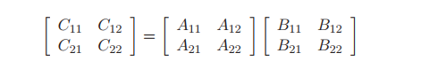

并考虑矩阵大小n较大的情况

```c
void bijk(array A, array B, array C, int n, int bsize)
{
	int i, j, k, kk, jj;
	double sum;
	int en = bsize * (n/bsize); /* Amount that fits evenly into blocks */

	for (i = 0; i < n; i++)
		for (j = 0; j < n; j++)
			C[i][j] = 0.0;

	for (kk = 0; kk < en; kk += bsize) {
		for (jj = 0; jj < en; jj += bsize) {
			for (i = 0; i < n; i++) { //对block进行计算
				for (j = jj; j < jj + bsize; j++) {
					sum = C[i][j];
					for (k = kk; k < kk + bsize; k++) {
						sum += A[i][k]*B[k][j];
					}
					C[i][j] = sum;
				}
			}
		}
	}
}
```

其原理是矩阵乘法的分配律，**将矩阵B分为块所在位置不为0，其余位置为0的矩阵**(B1,B2,....)，那么计算时只需要计算不为0的位置。

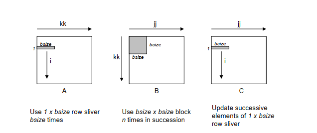

注意，block技术一般是用于编译优化，且代码不利于阅读，现在的cpu一般都有完善的预取硬件，因此分块并不会提高程序

### 代码

cache32组，每组一行，每行32字节=8int

#### M=32，N=32

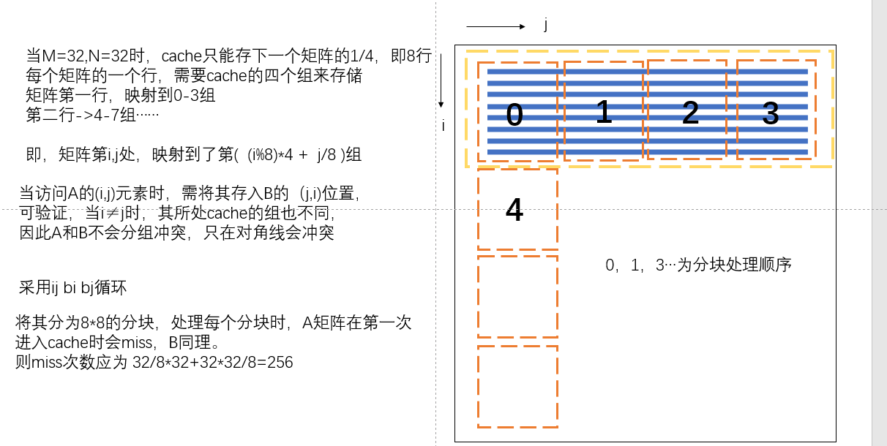

首先想到，采用8*8分块，miss=341。

问题在于对角线问题，易知M和N矩阵对角线映射到了cache的同一处，同时访问会驱逐内存。

```C
void transpose_submit(int M, int N, int A[N][M], int B[M][N])
{
    int i=0,j=0;
    int block_i=0,block_j=0;
    if(M==32&&N==32){
        for (i = 0; i < 32; i+=8) {
            for (j = 0; j < 32; j+=8) {
                for(block_i=i;block_i<i+8;block_i++){
                    for(block_j=j;block_j<j+8;block_j++){
                        B[block_j][block_i]=A[block_i][block_j];
                    }
                }
            }
        }
    }       
}
```

可以使用局部变量存储A的元素

```c
void transpose_submit(int M, int N, int A[N][M], int B[M][N])
{
    int i=0,j=0;
    int block_i=0;
    if(M==32&&N==32){
        for (i = 0; i < 32; i+=8) {
            for (j = 0; j < 32; j+=8) {
                for(block_i=i;block_i<i+8;block_i++){
                    int A0=A[block_i][j];
                    int A1=A[block_i][j+1];
                    int A2=A[block_i][j+2];
                    int A3=A[block_i][j+3];
                    int A4=A[block_i][j+4];
                    int A5=A[block_i][j+5];
                    int A6=A[block_i][j+6];
                    int A7=A[block_i][j+7];
                    B[j][block_i]=A0;
                    B[j+1][block_i]=A1;
                    B[j+2][block_i]=A2;
                    B[j+3][block_i]=A3;
                    B[j+4][block_i]=A4;
                    B[j+5][block_i]=A5;
                    B[j+6][block_i]=A6;
                    B[j+7][block_i]=A7; 
                }
            }
        }
    }
    

}
```

结果为miss=287

#### M=64,N=64

当M=64,N=64时，64*64/32/8=16

cache只能存下一个矩阵的1/16，即4行

每个矩阵的一个行，需要cache的8个组来存储

矩阵第一行，映射到0-7组；第二行映射到8-15组……

即，矩阵第i,j处，映射到了第( (i%4)*8 + j/8 )组，矩阵各个元素所在cache的组如下图所示

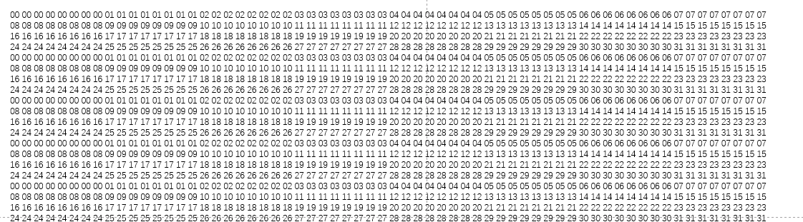

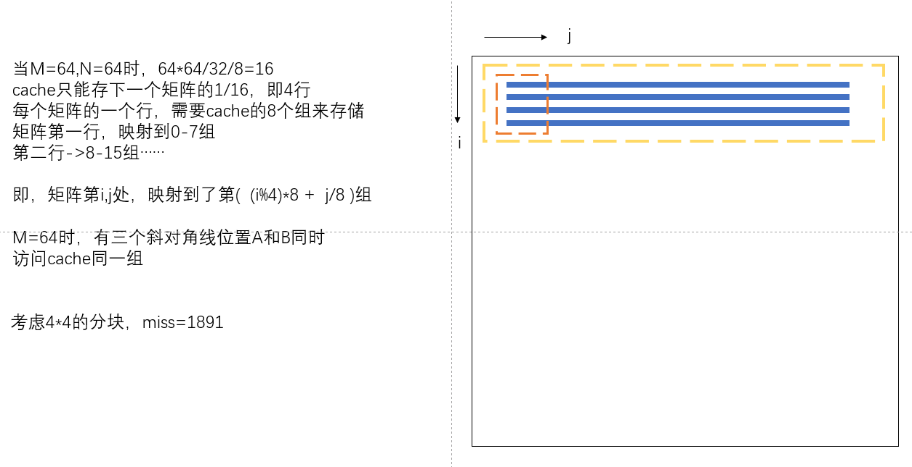

矩阵A如何映射到矩阵B如何所示，黄色方框表示cache内存空间，采用8*8的block，并分为4个4 *4 的小块。

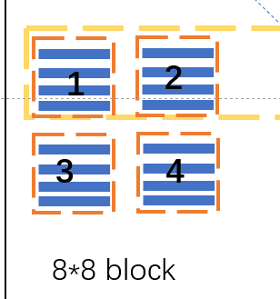

直接采用8*8block不可行的原因是，矩阵A是按行访问的，矩阵B是按列访问的，则矩阵B从块1到块2时（即从前4行写到后4行时），块1还没利用完就被块2替换掉了，因此miss增多。

==注意到，访问矩阵A的块3时，同时访问矩阵B的块3并不冲突。==

可采用如下方法：

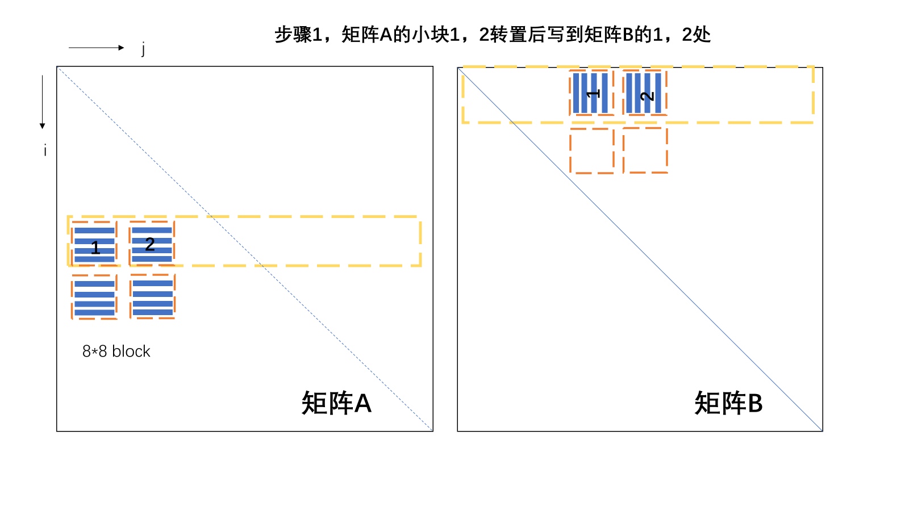

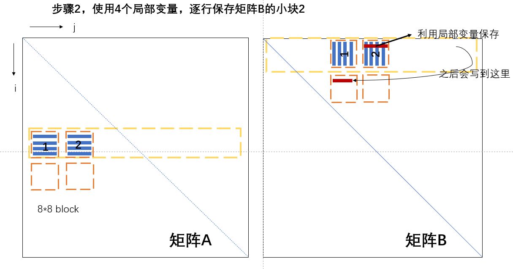


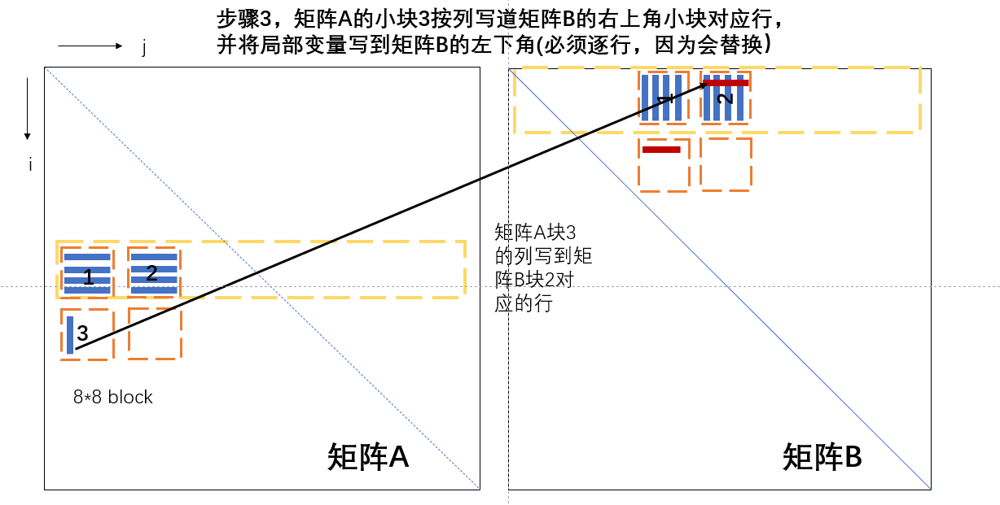


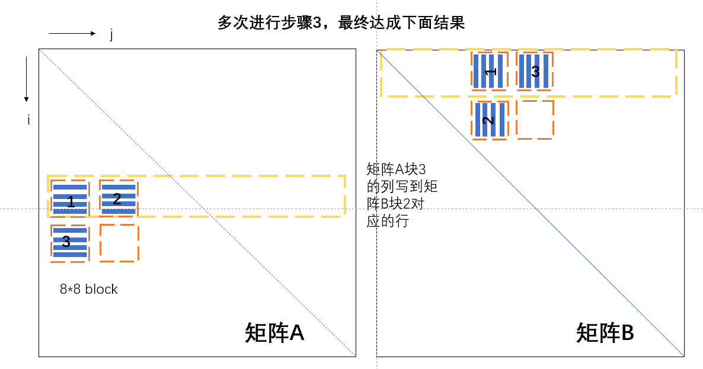

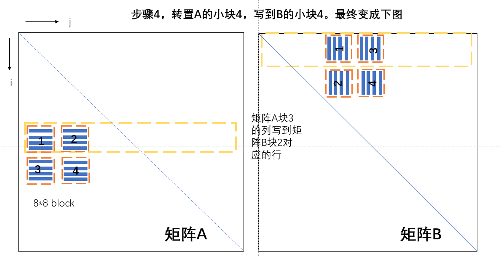

代码如下：

```c
		int i=0,j=0;
        int a_0, a_1, a_2, a_3, a_4, a_5, a_6, a_7;
        for (i = 0; i < 64; i+=8) {
            for (j = 0; j < 64; j+=8) {
                //步骤1
                for (int k = i; k < i + 4; k++){
                // 得到A的第1,2块
                a_0 = A[k][j + 0];
                a_1 = A[k][j + 1];
                a_2 = A[k][j + 2];
                a_3 = A[k][j + 3];
                a_4 = A[k][j + 4];
                a_5 = A[k][j + 5];
                a_6 = A[k][j + 6];
                a_7 = A[k][j + 7];
                // 复制给B的第1,2块
                B[j + 0][k] = a_0;
                B[j + 1][k] = a_1;
                B[j + 2][k] = a_2;
                B[j + 3][k] = a_3;
                B[j + 0][k + 4] = a_4;
                B[j + 1][k + 4] = a_5;
                B[j + 2][k + 4] = a_6;
                B[j + 3][k + 4] = a_7;
                }
                //步骤2，3 逐行处理B右上角，按列处理A的左下角
                //此处k表示A的列序号 即B的行序号
                for (int k = j; k < j + 4; k++){
                // 得到B的右上角块的每一行
                a_0 = B[k][i + 4];
                a_1 = B[k][i + 5];
                a_2 = B[k][i + 6];
                a_3 = B[k][i + 7];
                // 得到A的左下角的每一列
                a_4 = A[i + 4][k];
                a_5 = A[i + 5][k];
                a_6 = A[i + 6][k];
                a_7 = A[i + 7][k];
                // A的左下角列复制给B的右上角每一行
                B[k][i + 4] = a_4;
                B[k][i + 5] = a_5;
                B[k][i + 6] = a_6;
                B[k][i + 7] = a_7;
                // B的左上角每一行赋值给B的左下角每一行
                B[k + 4][i + 0] = a_0;
                B[k + 4][i + 1] = a_1;
                B[k + 4][i + 2] = a_2;
                B[k + 4][i + 3] = a_3;
                }
                //步骤4 最后一小块的转置
                for (int k = i + 4; k < i + 8; k++){
                    // 处理第4块
                    a_4 = A[k][j + 4];
                    a_5 = A[k][j + 5];
                    a_6 = A[k][j + 6];
                    a_7 = A[k][j + 7];
                    B[j + 4][k] = a_4;
                    B[j + 5][k] = a_5;
                    B[j + 6][k] = a_6;
                    B[j + 7][k] = a_7;
                }
            }
        }
```

misses=1227

#### M=61,N=67

16*16分块即可

misses=1992

## 参考

[CSAPP | Lab5-Cache Lab 深入解析 - 知乎 (zhihu.com)](https://zhuanlan.zhihu.com/p/484657229)
