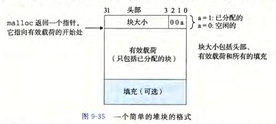
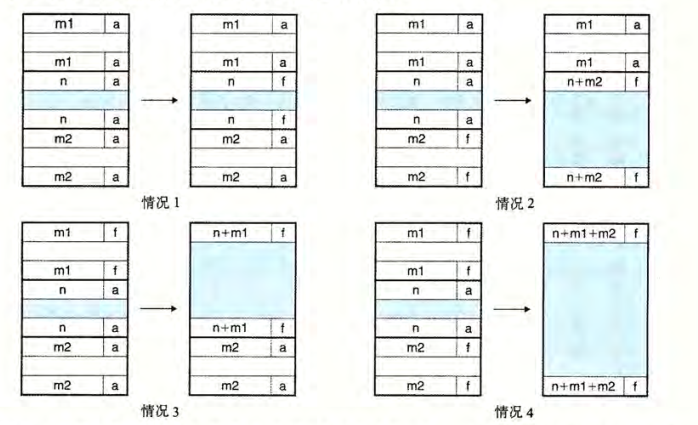
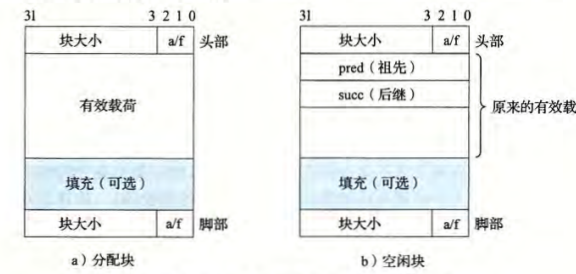

### 实验要求

修改下列函数 实现动态内存分配器 类似与libc的malloc

要求8字节对齐

```c 
int mm_init(void);
void *mm_malloc(size_t size); 
void mm_free(void *ptr); 
void *mm_realloc(void *ptr, size_t size);  
```

```利用mdriver.c进行测试 ```，-t指定trace目录，-f指定单个trace测试文件

允许使用`memlib.c`的函数，不允许使用其他动态内存分配库，不允许使用复合数据结构（如结构体等）

利用`gprof`优化性能，利用宏简化指针计算

### 开始

**make后，发现实验缺少trace文件**

补充trace文件，并在测试时指定路径  ```./mdriver -V -t traces/```

#### 采用隐式空闲链表 实现基础功能 

##### 原理及代码参考课本

其思路比较简单，头部和尾部存储块信息，这样就可以遍历所有块，从而间接的遍历空闲块。

因此其缺点是，块的搜索时间与块总数是线性关系。



堆的组织方式如下，每个方格是4字节的，头部和尾部的设计消除了合并时的边界影响。


空闲块合并时有以下四种情况。采用立即合并。



##### 代码

```c
/* 基础宏*/
#define WSIZE 4 // 字长4字节，块头尾信息也为4字节
#define DSIZE 8
#define CHUNKSIZZE (1 << 12) // 堆初始化大小 4KB 正好是页大小

#define MAX(x, y) ((x) > (y)) ? (x) : (y)
/* 把块大小和信息位结合*/
#define PACK(size, alloc) ((size) | (alloc))
/* 在地址p处读写 */
#define GET(p) (*(unsigned int *)(p))
#define PUT(p, val) (*(unsigned int *)(p) = (val))

/* 从头部或脚部 获取块大小和信息位的值 */
#define GET_SIZE(p) (GET(p) & ~0x07)
#define GET_ALLOC(p) (GET(p) & 0x1)

/*给定块指针bp，其指向有效载荷，计算头部和尾部指针*/
#define HDRP(bp) ((char *)(bp) - WSIZE)
#define FTRP(bp) ((char *)(bp) + GET_SIZE(HDRP(bp)) - DSIZE)

/* 给定块指针bp, 计算先前块和后面块的地址 */
#define NEXT_BLKP(bp) ((char *)(bp) + GET_SIZE((char *)(bp) - WSIZE))
#define PREV_BLKP(bp) ((char *)(bp) - GET_SIZE((char *)(bp) - DSIZE))

char *heap_listp = NULL;
int mm_init(void);
void *extend_heap(size_t words);
void *coalesce(void *bp);
void *mm_malloc(size_t size);
void *find_fit(size_t asize);
void place(void *bp, size_t asize);
void mm_free(void *ptr);
void *mm_realloc(void *ptr, size_t size);

/*
 * mm_init - initialize the malloc package.
 */
int mm_init(void)
{
    // 申请四个字 用于存储起始块、结尾块和序言块
    if ((heap_listp = mem_sbrk(4 * WSIZE)) == (void *)-1)
        return -1;
    PUT(heap_listp, 0);
    PUT(heap_listp + WSIZE, PACK(8, 1));
    PUT(heap_listp + 2 * WSIZE, PACK(8, 1));
    PUT(heap_listp + 3 * WSIZE, PACK(0, 1));
    heap_listp += (2 * WSIZE);
    // 申请一个初始的空闲块
    if (extend_heap(CHUNKSIZZE / WSIZE) == NULL)
        return -1; // 申请失败
    return 0;
}

/* 扩展堆 以字为单位*/
void *extend_heap(size_t words)
{
    char *bp;
    size_t size;

    size = (words % 2) ? (words + 1) * WSIZE : words * WSIZE;
    if ((long)(bp = mem_sbrk(size)) == -1)
        return NULL; // 申请失败

    PUT(HDRP(bp), PACK(size, 0)); // 设置头部和脚步
    PUT(FTRP(bp), PACK(size, 0));
    PUT(HDRP(NEXT_BLKP(bp)), PACK(0, 1)); // 设置结尾块

    // 扩展堆之后，结尾块后面紧跟的就是有效载荷，结尾块变成该载荷的头部
    return coalesce(bp);
}

// 合并空闲块 序言块和结尾块 有效避免了边界处理
// 参数bp指向有效载荷
void *coalesce(void *bp)
{
    size_t prev_alloc = GET_ALLOC(FTRP(PREV_BLKP(bp)));
    size_t next_alloc = GET_ALLOC(HDRP(NEXT_BLKP(bp)));
    size_t size = GET_SIZE(HDRP(bp));

    if (prev_alloc && next_alloc)
    {
        return bp;
    }
    else if (prev_alloc && !next_alloc)
    {
        size += GET_SIZE(HDRP(NEXT_BLKP(bp)));
        PUT(HDRP(bp), PACK(size, 0));
        PUT(FTRP(bp), PACK(size, 0));
    }
    else if (!prev_alloc && next_alloc)
    {
        size += GET_SIZE(HDRP(PREV_BLKP(bp)));
        PUT(FTRP(bp), PACK(size, 0));
        PUT(HDRP(PREV_BLKP(bp)), PACK(size, 0));
        bp = PREV_BLKP(bp);
    }
    else
    {
        size += GET_SIZE(HDRP(PREV_BLKP(bp))) +
                GET_SIZE(FTRP(NEXT_BLKP(bp)));
        PUT(HDRP(PREV_BLKP(bp)), PACK(size, 0));
        PUT(FTRP(NEXT_BLKP(bp)), PACK(size, 0));
        bp = PREV_BLKP(bp);
    }
    return bp;
}
/*
 * mm_malloc - Allocate a block by incrementing the brk pointer.
 *     Always allocate a block whose size is a multiple of the alignment.
 */
void *mm_malloc(size_t size)
{
    size_t asize;       // adjust block size
    size_t extend_size; // extend heap size
    char *bp;

    if (size == 0)
        return NULL;

    // 块最小为16字节   有效载荷最小为8字节  要求按八字节对齐
    // 有效载荷小于8 则按8处理；大于8，则向上舍入到8的倍数
    if (size <= DSIZE)
        asize = 2 * DSIZE;
    else
        asize = DSIZE * ((size + DSIZE - 1) / DSIZE) + DSIZE;

    // 寻找合适的空闲块
    if ((bp = find_fit(asize)) != NULL)
    {
        place(bp, asize);
        return bp;
    }

    // 没找到合适块 则需要扩展堆 按至少4kB大小来扩展
    extend_size = MAX(asize, CHUNKSIZZE);
    if ((bp = extend_heap(extend_size / WSIZE)) == NULL)
        return NULL;
    place(bp, asize);
    return bp;
}

// find fit free block
void *find_fit(size_t asize)
{
    void *bp;
    for (bp = heap_listp; GET_SIZE(HDRP(bp)) > 0; bp = NEXT_BLKP(bp))
    {
        if (!GET_ALLOC(HDRP(bp)) && (asize <= GET_SIZE(HDRP(bp))))
            return bp;
    }
    return NULL;
}

// replace free block
void place(void *bp, size_t asize)
{
    size_t csize = GET_SIZE(HDRP(bp)); // 空闲块大小

    // 剩余块大于16字节 则需要分割空闲块 否则直接作为内部碎片
    if ((csize - asize) >= 2 * DSIZE)
    {
        PUT(HDRP(bp), PACK(asize, 1));
        PUT(FTRP(bp), PACK(asize, 1));
        bp = NEXT_BLKP(bp);
        PUT(HDRP(bp), PACK(csize - asize, 0));
        PUT(FTRP(bp), PACK(csize - asize, 0));
    }
    else
    {
        PUT(HDRP(bp), PACK(csize, 1));
        PUT(FTRP(bp), PACK(csize, 1));
    }
}
/*
 * mm_free - Freeing a block does nothing.
 */
void mm_free(void *ptr)
{
    size_t size = GET_SIZE(HDRP(ptr));
    PUT(HDRP(ptr), PACK(size, 0));
    PUT(FTRP(ptr), PACK(size, 0));
    coalesce(ptr);
}

/*
 * mm_realloc - Implemented simply in terms of mm_malloc and mm_free
 */
void *mm_realloc(void *ptr, size_t size)
{
    void *oldptr = ptr;
    void *newptr;
    size_t copySize;

    newptr = mm_malloc(size);
    if (newptr == NULL)
        return NULL;
    // copySize = *(size_t *)((char *)oldptr - SIZE_T_SIZE);
    copySize = GET_SIZE(HDRP(ptr));

    if (size < copySize)
        copySize = size;
    memcpy(newptr, oldptr, copySize);
    mm_free(oldptr);
    return newptr;
}

```


##### 结果

```
Team Name:ateam
Member 1 :thz:caiji@edu.cn
Using default tracefiles in traces/
Measuring performance with gettimeofday().

Testing mm malloc
Reading tracefile: amptjp-bal.rep
Checking mm_malloc for correctness, efficiency, and performance.
Reading tracefile: cccp-bal.rep
Checking mm_malloc for correctness, efficiency, and performance.
Reading tracefile: cp-decl-bal.rep
Checking mm_malloc for correctness, efficiency, and performance.
Reading tracefile: expr-bal.rep
Checking mm_malloc for correctness, efficiency, and performance.
Reading tracefile: coalescing-bal.rep
Checking mm_malloc for correctness, efficiency, and performance.
Reading tracefile: random-bal.rep
Checking mm_malloc for correctness, efficiency, and performance.
Reading tracefile: random2-bal.rep
Checking mm_malloc for correctness, efficiency, and performance.
Reading tracefile: binary-bal.rep
Checking mm_malloc for correctness, efficiency, and performance.
Reading tracefile: binary2-bal.rep
Checking mm_malloc for correctness, efficiency, and performance.
Reading tracefile: realloc-bal.rep
Checking mm_malloc for correctness, efficiency, and performance.
Reading tracefile: realloc2-bal.rep
Checking mm_malloc for correctness, efficiency, and performance.

Results for mm malloc:
trace  valid  util     ops      secs  Kops
 0       yes   99%    5694  0.004855  1173
 1       yes   99%    5848  0.004422  1322
 2       yes   99%    6648  0.007381   901
 3       yes  100%    5380  0.005453   987
 4       yes   66%   14400  0.000062231884
 5       yes   92%    4800  0.004685  1025
 6       yes   92%    4800  0.004363  1100
 7       yes   55%   12000  0.065336   184
 8       yes   51%   24000  0.215049   112
 9       yes   27%   14401  0.037013   389
10       yes   34%   14401  0.001492  9653
Total          74%  112372  0.350112   321

Perf index = 44 (util) + 21 (thru) = 66/100
```

#### 85分的方案 显式链表+分离适配

##### 显式链表 教材p603

隐式链表在查找时需要遍历所有的块，包括分配的和空闲的；

显式链表通过在空闲块中记录其前驱和后续空闲块，这样查找时只需遍历空闲块。



##### 分离适配 教材p604

通过将空闲块按照大小分为**大小类**，按照2的幂划分为若干组，[0,1),[2,4],[4,8],[8,16]......，并记录每组的头指针。

其优点时，遍历空闲块时则不需遍历所有空闲块，只需遍历特定的空闲块。

##### 代码及注释

```c
/*
 * mm-naive.c - The fastest, least memory-efficient malloc package.
 *
 * In this naive approach, a block is allocated by simply incrementing
 * the brk pointer.  A block is pure payload. There are no headers or
 * footers.  Blocks are never coalesced or reused. Realloc is
 * implemented directly using mm_malloc and mm_free.
 *
 * NOTE TO STUDENTS: Replace this header comment with your own header
 * comment that gives a high level description of your solution.
 */
#include <stdio.h>
#include <stdlib.h>
#include <assert.h>
#include <unistd.h>
#include <string.h>

#include "mm.h"
#include "memlib.h"

/*********************************************************
 * NOTE TO STUDENTS: Before you do anything else, please
 * provide your team information in the following struct.
 ********************************************************/
team_t team = {
    /* Team name */
    "ateam",
    /* First member's full name */
    "thz",
    /* First member's email address */
    "caiji@edu.cn",
    /* Second member's full name (leave blank if none) */
    "",
    /* Second member's email address (leave blank if none) */
    ""};

/* single word (4) or double word (8) alignment */
#define ALIGNMENT 8

/* rounds up to the nearest multiple of ALIGNMENT */
#define ALIGN(size) (((size) + (ALIGNMENT - 1)) & ~0x7)

#define SIZE_T_SIZE (ALIGN(sizeof(size_t)))

///////////////////////////////// Block information /////////////////////////////////////////////////////////
/*

A   : Allocated? (1: true, 0:false)
RA  : Reallocation tag (1: true, 0:false) 

 < Allocated Block >


             31 30 29 28 27 26 25 24 23 22 21 20 19 18 17 16 15 14 13 12 11 10  9  8  7  6  5  4  3  2  1  0
            +--+--+--+--+--+--+--+--+--+--+--+--+--+--+--+--+--+--+--+--+--+--+--+--+--+--+--+--+--+--+--+--+
 Header :   |                              size of the block                                       |  |  | A|
    bp ---> +--+--+--+--+--+--+--+--+--+--+--+--+--+--+--+--+--+--+--+--+--+--+--+--+--+--+--+--+--+--+--+--+
            |                                                                                               |
            |                                                                                               |
            .                              Payload and padding                                              .
            .                                                                                               .
            .                                                                                               .
            +--+--+--+--+--+--+--+--+--+--+--+--+--+--+--+--+--+--+--+--+--+--+--+--+--+--+--+--+--+--+--+--+
 Footer :   |                              size of the block                                       |     | A|
            +--+--+--+--+--+--+--+--+--+--+--+--+--+--+--+--+--+--+--+--+--+--+--+--+--+--+--+--+--+--+--+--+


 < Free block >
 pred指向更小的block  succ指向更大的block

             31 30 29 28 27 26 25 24 23 22 21 20 19 18 17 16 15 14 13 12 11 10  9  8  7  6  5  4  3  2  1  0
            +--+--+--+--+--+--+--+--+--+--+--+--+--+--+--+--+--+--+--+--+--+--+--+--+--+--+--+--+--+--+--+--+
 Header :   |                              size of the block                                       |  |  | A|
    bp ---> +--+--+--+--+--+--+--+--+--+--+--+--+--+--+--+--+--+--+--+--+--+--+--+--+--+--+--+--+--+--+--+--+
            |                        pointer to its predecessor in Segregated list                          |
bp+WSIZE--> +--+--+--+--+--+--+--+--+--+--+--+--+--+--+--+--+--+--+--+--+--+--+--+--+--+--+--+--+--+--+--+--+
            |                        pointer to its successor in Segregated list                            |
            +--+--+--+--+--+--+--+--+--+--+--+--+--+--+--+--+--+--+--+--+--+--+--+--+--+--+--+--+--+--+--+--+
            .                                                                                               .
            .                                                                                               .
            .                                                                                               .
            +--+--+--+--+--+--+--+--+--+--+--+--+--+--+--+--+--+--+--+--+--+--+--+--+--+--+--+--+--+--+--+--+
 Footer :   |                              size of the block                                       |     | A|
            +--+--+--+--+--+--+--+--+--+--+--+--+--+--+--+--+--+--+--+--+--+--+--+--+--+--+--+--+--+--+--+--+
*/
///////////////////////////////// End of Block information /////////////////////////////////////////////////////////

/* 基础宏*/
#define WSIZE 4 // 字长4字节，块头尾信息也为4字节
#define DSIZE 8
#define CHUNKSIZE (1 << 12) // 堆初始化大小 4KB 正好是页大小

#define MAX(x, y) ((x) > (y)) ? (x) : (y)
/* 把块大小和信息位结合*/
#define PACK(size, alloc) ((size) | (alloc))
/* 在地址p处读写 */
#define GET(p) (*(unsigned int *)(p))
#define PUT(p, val) (*(unsigned int *)(p) = (val))

/*在pred和succ处设置指针*/
#define SET_PTR(bp, ptr) (*(unsigned int *)(bp) = (unsigned int)(ptr))

/* 从头部或脚部 获取块大小和信息位的值 */
#define GET_SIZE(p) (GET(p) & ~0x7)
#define GET_ALLOC(p) (GET(p) & 0x1)

/*给定块指针bp，其指向有效载荷，计算头部和尾部指针*/
#define HDRP(bp) ((char *)(bp) - WSIZE)
#define FTRP(bp) ((char *)(bp) + GET_SIZE(HDRP(bp)) - DSIZE)

/* 给定块指针bp, 计算先前块和后面块的地址 */
#define NEXT_BLKP(bp) ((char *)(bp) + GET_SIZE((char *)(bp) - WSIZE))
#define PREV_BLKP(bp) ((char *)(bp) - GET_SIZE((char *)(bp) - DSIZE))

/* 获取块的pred处和succ处*/
#define PRED(bp) ((char *)bp)
#define SUCC(bp) ((char *)(bp) + WSIZE)

/* 获取块的pred块和succ块*/
#define PRED_BLOCK(bp) (*(char **)(bp))
#define SUCC_BLOCK(bp) (*(char **)(SUCC(bp)))

/* 链表大小类的组数 */
#define LIST_SIZE 20

/*debug macros*/
#define DEBUG_HEAP_INFO 0
#define DEBUG_ORDER 0
#define MM_INIT 00
#define MM_MALLOC 11
#define MM_FREE 22

/*  basic func */
void *extend_heap(size_t size);
void *coalesce(void *bp);
void *find_first_fit(size_t asize);
void place(void *bp, size_t asize);
int find_list_idx(size_t size);
void add_node(void *bp);
void delete_node(void *bp);

/* debug func */
void print_heap(int debug, int flag);
void print_free_list(int debug);
void printf_command_number(int bebug, int flag);

char *heap_listp = NULL; // 序言块位置 用于打印heap

// 分离空闲链表 由于块大小至少为16,堆最大为20*(1<<20)  可将大小类分为[2^0,2^1).. [2^4,2^5),[2^5,2^6)......[2^19,2^20) 共计20类
void *segregated_free_lists[LIST_SIZE];

/*-------------------------------help function-----------------------*/
/* 扩展堆
 * 以字节为单位
 * 扩展后合并这个新申请的空闲块
 * */
void *extend_heap(size_t size)
{
    char *bp;

    // size = ALIGN(size);
    if ((long)(bp = mem_sbrk(size)) == -1)
        return NULL; // 申请失败

    PUT(HDRP(bp), PACK(size, 0)); // 设置头部和脚步
    PUT(FTRP(bp), PACK(size, 0));
    PUT(HDRP(NEXT_BLKP(bp)), PACK(0, 1)); // 设置结尾块
    // 扩展堆之后，结尾块后面紧跟的就是有效载荷，结尾块变成该载荷的头部
    return coalesce(bp);
}

int find_list_idx(size_t size)
{
    int list_idx = 0;
    // find list_idx      [0,2)--->idx=0  [16,32)  <---->  idx=4
    while (size > 1 && list_idx < (LIST_SIZE - 1))
    {
        size >>= 1;
        list_idx++;
    }
    return list_idx;
}
/*
 * 在链表中插入新的空闲块
 */
void add_node(void *bp)
{
    int list_idx = 0;
    size_t size = GET_SIZE(HDRP(bp));
    list_idx = find_list_idx(size);

    void *pred_pos = NULL;
    void *succ_pos = segregated_free_lists[list_idx];
    // 所在大小类的链表为空
    if (succ_pos == NULL)
    {
        segregated_free_lists[list_idx] = bp;
        PUT(PRED(bp), (unsigned int)(NULL));
        PUT(SUCC(bp), (unsigned int)(NULL));
    }
    // 所在大小类的链表不为空
    else
    {
        // 从小到大遍历大小类 找到第一个大于等于插入块的位置 并记录其前驱块
        while (succ_pos != NULL && size > GET_SIZE(HDRP(succ_pos)))
        {
            pred_pos = succ_pos;
            succ_pos = SUCC_BLOCK(succ_pos);
        }
        // 链表中仅一个空闲块 且大于等于插入块
        if (pred_pos == NULL && succ_pos != NULL)
        {
            // PUT(PRED(bp), (unsigned int)NULL);
            // PUT(SUCC(bp), (unsigned int)(succ_pos));
            // PUT(PRED(succ_pos), (unsigned int)bp);
            SET_PTR(PRED(bp), NULL);
            SET_PTR(SUCC(bp), succ_pos);
            SET_PTR(PRED(succ_pos), bp);
            segregated_free_lists[list_idx] = bp;
        }
        // 链表空闲块都小于插入块
        else if (succ_pos == NULL && pred_pos != NULL)
        {
            // PUT(PRED(bp), (unsigned int)pred_pos);
            // PUT(SUCC(bp), (unsigned int)NULL);
            // PUT(SUCC(pred_pos), (unsigned int)bp);
            SET_PTR(PRED(bp), pred_pos);
            SET_PTR(SUCC(bp), NULL);
            SET_PTR(SUCC(pred_pos), bp);
        }
        // 插入块在链表中间
        else
        {
            // PUT(PRED(bp), (unsigned int)pred_pos);
            // PUT(SUCC(pred_pos), (unsigned int)bp);
            // PUT(SUCC(bp), (unsigned int)succ_pos);
            // PUT(PRED(succ_pos), (unsigned int)bp);
            SET_PTR(PRED(bp), pred_pos);
            SET_PTR(SUCC(pred_pos), bp);
            SET_PTR(SUCC(bp), succ_pos);
            SET_PTR(PRED(succ_pos), bp);
        }
    }
}

/*
 * 在链表中删除指定的空闲块  依赖于node指向块的大小
 */
void delete_node(void *bp)
{
    if (bp == NULL)
        return;

    // find list_idx        size=16  <---->  idx=0
    int list_idx = 0;
    size_t size = GET_SIZE(HDRP(bp));
    list_idx = find_list_idx(size);

    void *pred_block = PRED_BLOCK(bp);
    void *succ_block = SUCC_BLOCK(bp);

    // 链表的四种情况
    if (pred_block == NULL && succ_block == NULL)
    {
        segregated_free_lists[list_idx] = NULL;
    }
    else if (pred_block != NULL && succ_block == NULL)
    {
        // PUT(SUCC(pred_block), (unsigned int)NULL);
        SET_PTR(SUCC(pred_block), NULL);
    }
    else if (pred_block == NULL && succ_block != NULL)
    {
        // PUT(PRED(succ_block), (unsigned int)NULL);
        SET_PTR(PRED(succ_block), NULL);
        segregated_free_lists[list_idx] = succ_block;
    }
    else
    {
        // PUT(PRED(succ_block), (unsigned int)pred_block);
        // PUT(SUCC(pred_block), (unsigned int)succ_block);
        SET_PTR(PRED(succ_block), pred_block);
        SET_PTR(SUCC(pred_block), succ_block);
    }
}

/*
 * 合并空闲块 序言块和结尾块 有效避免了边界处理
 * 参数bp指向有效载荷
 * 合并时在链表中删除前后的空闲块
 * 返回合并后的bp
 */
void *coalesce(void *bp)
{
    void *prev_block = PREV_BLKP(bp);
    void *next_block = NEXT_BLKP(bp);

    size_t prev_alloc = GET_ALLOC(HDRP(prev_block));
    size_t next_alloc = GET_ALLOC(HDRP(next_block));
    size_t size = GET_SIZE(HDRP(bp));

    if (prev_alloc && next_alloc)
    {
        return bp;
    }
    else if (prev_alloc && !next_alloc)
    {
        size += GET_SIZE(HDRP(NEXT_BLKP(bp)));
        delete_node(next_block);
        PUT(HDRP(bp), PACK(size, 0));
        PUT(FTRP(bp), PACK(size, 0));
    }
    else if (!prev_alloc && next_alloc)
    {
        size += GET_SIZE(HDRP(PREV_BLKP(bp)));
        delete_node(prev_block);
        PUT(FTRP(bp), PACK(size, 0));
        PUT(HDRP(prev_block), PACK(size, 0));
        bp = prev_block;
    }
    else
    {
        size += (GET_SIZE(FTRP(PREV_BLKP(bp))) +
                 GET_SIZE(HDRP(NEXT_BLKP(bp))));
        delete_node(prev_block);
        delete_node(next_block);
        PUT(HDRP(PREV_BLKP(bp)), PACK(size, 0));
        PUT(FTRP(NEXT_BLKP(bp)), PACK(size, 0));
        bp = PREV_BLKP(bp);
    }
    return bp;
}

// find fit free block
void *find_first_fit(size_t size)
{

    int list_idx = 0;
    list_idx = find_list_idx(size);
    while (list_idx <= (LIST_SIZE - 1))
    {
        void *target_free_block = segregated_free_lists[list_idx];
        // 找到第一个大于等于插入块的位置  从小到大遍历大小类
        while (target_free_block != NULL && size > GET_SIZE(HDRP(target_free_block)))
        {
            target_free_block = SUCC_BLOCK(target_free_block);
        }
        if (target_free_block != NULL && size <= GET_SIZE(HDRP(target_free_block)))
            return target_free_block;
        list_idx++;
    }
    // target_free_block==NULL 则要么大小类为空 要么大小类的块均不满足
    return NULL;
}

// replace free block
void place(void *bp, size_t asize)
{
    size_t csize = GET_SIZE(HDRP(bp)); // 空闲块大小

    // 剩余块大于等于16字节 则需要分割空闲块 否则直接作为内部碎片
    if ((csize - asize) < 2 * DSIZE)
    {
        PUT(HDRP(bp), PACK(csize, 1));
        PUT(FTRP(bp), PACK(csize, 1));
    }
    else
    {
        PUT(HDRP(bp), PACK(asize, 1));
        PUT(FTRP(bp), PACK(asize, 1));
        bp = NEXT_BLKP(bp);
        PUT(HDRP(bp), PACK(csize - asize, 0));
        PUT(FTRP(bp), PACK(csize - asize, 0));
        add_node(bp); // 添加新的空闲块
    }
}

/*-------------------------------------end help function------------------------ */
/*
 * mm_init - initialize the malloc package.
 */
int mm_init(void)
{
    char *brk;
    // 申请四个字 用于存储起始块、结尾块和序言块
    if ((brk = mem_sbrk(4 * WSIZE)) == (void *)(-1))
        return -1;
    // 一定要清空链表 因为mdriver会多次执行rep文件，
    // 每次执行之后,会产生一个很大的堆空间,必须清空对它的记录
    // 这说明变量使用前初始化是个好习惯
    for (int i = 0; i < LIST_SIZE; i++)
    {
        segregated_free_lists[i] = NULL;
    }
    PUT(brk, 0);
    PUT(brk + WSIZE, PACK(8, 1));
    PUT(brk + 2 * WSIZE, PACK(8, 1));
    PUT(brk + 3 * WSIZE, PACK(0, 1));
    heap_listp = brk + DSIZE;
    // 申请一个初始的空闲块
    if ((brk = extend_heap(CHUNKSIZE)) == NULL)
        return -1; // 申请失败
    add_node(brk); // 添加到链表
    print_heap(DEBUG_HEAP_INFO, MM_INIT);
    print_free_list(DEBUG_HEAP_INFO);
    return 0;
}

/*
 * mm_malloc - Allocate a block by incrementing the brk pointer.
 *     Always allocate a block whose size is a multiple of the alignment.
 */
void *mm_malloc(size_t size)
{
    size_t asize;       // adjust block size
    size_t extend_size; // extend heap size
    char *bp;

    if (size == 0)
        return NULL;

    // 块最小为16字节   有效载荷最小为8字节  要求按八字节对齐
    // 有效载荷小于8 则按16处理；大于8，则加8后向上舍入到8的倍数
    if (size <= DSIZE)
        asize = 2 * DSIZE;
    else
        asize = ALIGN(size + 8);

    // 寻找合适的空闲块
    if ((bp = find_first_fit(asize)) != NULL)
    {
        delete_node(bp);
        place(bp, asize);
    }
    else
    // 没找到合适块 则需要扩展堆 按至少4kB大小来扩展
    {
        extend_size = MAX(asize, CHUNKSIZE);
        if ((bp = extend_heap(extend_size)) == NULL)
            return NULL;
        place(bp, asize);
    }
    print_heap(DEBUG_HEAP_INFO, MM_MALLOC);
    print_free_list(DEBUG_HEAP_INFO);
    printf_command_number(DEBUG_ORDER, MM_MALLOC);
    return bp;
}

/*
 * mm_free - Freeing a block does nothing.
 */
void mm_free(void *ptr)
{
    size_t size = GET_SIZE(HDRP(ptr));
    PUT(HDRP(ptr), PACK(size, 0));
    PUT(FTRP(ptr), PACK(size, 0));
    void *bp = coalesce(ptr); // 合并空闲块
    add_node(bp);             // 记录在链表中
    print_heap(DEBUG_HEAP_INFO, MM_FREE);
    print_free_list(DEBUG_HEAP_INFO);
    printf_command_number(DEBUG_ORDER, MM_FREE);
}

/*
 * mm_realloc - Implemented simply in terms of mm_malloc and mm_free
 */
void *mm_realloc(void *ptr, size_t size)
{
    void *oldptr = ptr;
    void *newptr;
    size_t copySize;

    newptr = mm_malloc(size);
    if (newptr == NULL)
        return NULL;
    // copySize = *(size_t *)((char *)oldptr - SIZE_T_SIZE);
    copySize = GET_SIZE(HDRP(ptr));

    if (size < copySize)
        copySize = size;
    memcpy(newptr, oldptr, copySize);
    mm_free(oldptr);
    return newptr;
}

/*-----------------------------------check heap-------------------------------------*/
void print_heap(int debug, int flag)
{
    if (!debug)
        return;
    char *heap_st = heap_listp;
    char *block_adr = NULL;
    int block_size = 0;
    int alloc_bit = 0;
    int alloc_free_count = 0;
    static int debug_count = 5; // 打印rep的命令序号 printf heap

    // 打印到结尾块
    printf("--command order:%d--------------------------heap info for debug------------------------------------\n", debug_count);
    while (GET_SIZE(HDRP(heap_st)) != 0)
    {
        block_adr = (char *)heap_st;
        block_size = GET_SIZE(HDRP(heap_st));
        alloc_bit = GET_ALLOC(HDRP(heap_st));
        if (alloc_bit == 0)
            alloc_free_count++;
        printf("--------------------------\n");
        printf("| ad=%x               |\n", (unsigned int)block_adr);
        printf("| size=%8d |  alloc=%d  |\n", block_size, alloc_bit);
        heap_st = NEXT_BLKP(heap_st);
    }
    printf("alloc free count:%d\n", alloc_free_count);
    printf("--command order:%d--------------------------end heap info for debug----------------------------------\n", debug_count);
    printf("\n");
    printf("\n");
    if (flag == MM_MALLOC || flag == MM_FREE)
        debug_count++;
}

void print_free_list(int debug)
{
    if (!debug)
        return;
    void *block_st = NULL;
    printf("\n");
    printf("-----------------------------------list info for debug--------------------------------------------\n");
    for (int i = 0; i < LIST_SIZE; i++)
    {
        block_st = segregated_free_lists[i];
        if (block_st == NULL)
        {
            // printf("list is NULL\n");
            continue;
        }
        else
        {
            printf("--------list idx:%d---------[%d,%d)\n", i, 1 << i, 1 << (i + 1));
            printf("%x\n", (unsigned int)block_st);
            while (block_st != NULL)
            {
                printf("%x: size:%d---->", (unsigned int)block_st, GET_SIZE(HDRP(block_st)));
                block_st = SUCC_BLOCK(block_st);
            }
            printf("\n");
        }
    }
    printf("-----------------------------------end list info for debug--------------------------------------------\n");
    printf("\n");
}

void printf_command_number(int debug, int flag)
{
    static int order_count = 5; // 打印rep的命令序号  用于
    if (!debug)
        return;
    printf("--command order:%d----\n", order_count);
    if (flag == MM_MALLOC || flag == MM_FREE)
        order_count++;
}

/*-----------------------------------end check heap-------------------------------------*/

```


##### 结果

```
Results for mm malloc:
trace  valid  util     ops      secs  Kops
 0       yes   99%    5694  0.000189 30207
 1       yes   99%    5848  0.000173 33764
 2       yes   99%    6648  0.000204 32636
 3       yes  100%    5380  0.000159 33752
 4       yes   66%   14400  0.000242 59627
 5       yes   96%    4800  0.000445 10791
 6       yes   95%    4800  0.000458 10478
 7       yes   55%   12000  0.000249 48290
 8       yes   51%   24000  0.000588 40823
 9       yes   31%   14401  0.037130   388
10       yes   30%   14401  0.001842  7819
Total          75%  112372  0.041677  2696

Perf index = 45 (util) + 40 (thru) = 85/100
```

#### 重写realloc

该方案可以达到90+的分数 时间原因暂未实现 

### 事项

定义了许多宏，用于指针的强制类型转换，涉及虚拟内存地址的读写操作。

该实验会遇到大量的segmentation fault和payload overlap。

前者一般是访问到了未分配的虚拟空间，后者是分配块重叠了。

### 参考

[CSAPP | Lab8-Malloc Lab 深入解析 - 知乎 (zhihu.com)](https://zhuanlan.zhihu.com/p/496366818)

[tinyargonaut/Malloc-Lab: Malloc Lab from CMU. Contains only mm.c (98/100 performance) with detailed comments (github.com)](https://github.com/tinyargonaut/Malloc-Lab)
