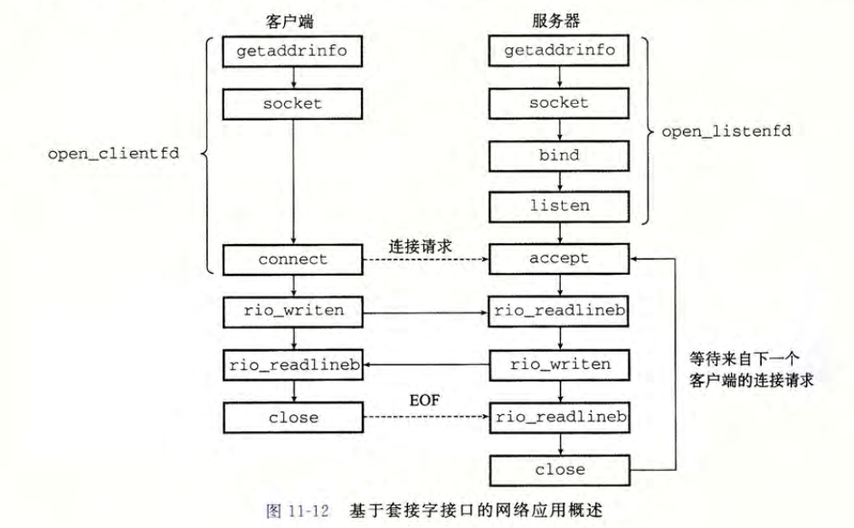
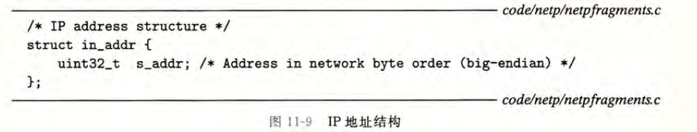
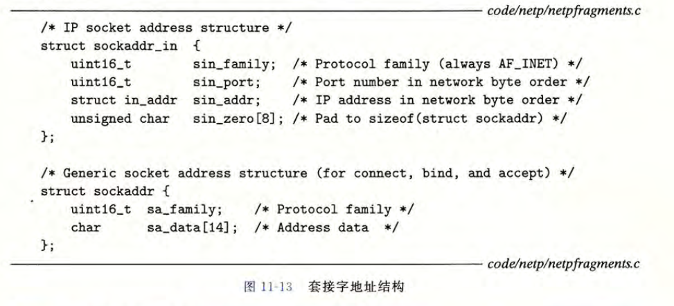
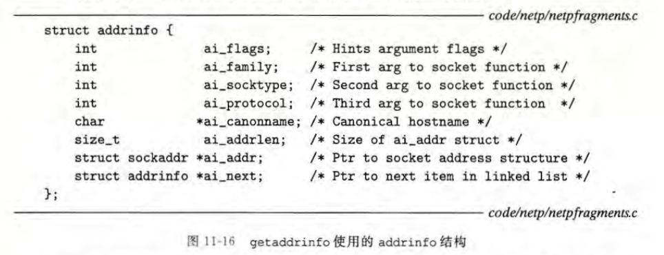
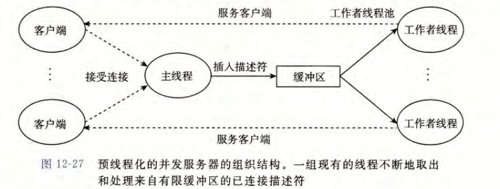

### 实验要求

实现一个web代理，实验分为三部分；

第一部分，接收和解析客户端的请求，传递给服务端，并把服务端的回复传递给客户端；

第二部分，处理并发的请求；

第三部分，利用cache缓存最近请求的web内容。

可以利用curl模拟HTTP事务，进行调试。例如`curl -v --proxy http://localhost:15214 http://localhost:15213/home.html`

### 网络编程基础



需要记住客户端和服务端连接的过程。





套接字地址结构如上。

利用`getaddrinfo`可以更便捷地构建套接字地址结构。其返回一个指向`addrinfo`的链表



本书编写了`open_clientfd`和`open_listenfd`简化了客户端和服务端的连接过程。

### TINY WEB服务器

```c
void doit(int fd);   //处理HTTP事务
void read_requesthdrs(rio_t *rp);   //处理请求报头 只在HTTP/1.1需要
int parse_uri(char *uri, char *filename, char *cgiargs);   //解析uri
void serve_static(int fd, char *filename, int filesize);        
void get_filetype(char *filename, char *filetype);
void serve_dynamic(int fd, char *filename, char *cgiargs);
void clienterror(int fd, char *cause, char *errnum, 
		 char *shortmsg, char *longmsg);  //解释错误信息
```

### PART 1 实现简单的proxy

1. 浏览器向proxy发送`GET http://www.cmu.edu/hub/index.html HTTP/1.1  `，然后proxy向`www.cmu.edu`发送`GET /hub/index.html HTTP/1.0  `。注意浏览器发送`HTTP/1.1`，proxy发送`HTTP/1.0`。

2. ==请求行==以`\r\n`结束每行.

3. 请求行之后跟随的是一行或多行==请求报头==。最后以`\r\n`终止请求。需要添加以下报头信息。

- `Host`: 如 `Host: www.cmu.edu`

- `User-Agent`: 如 `User-Agent: Mozilla/5.0 (X11; Linux x86_64; rv:10.0.3) Gecko/20120305 Firefox/10.0.3`

  在`proxy.c`中提供了`user_agent_hdr`信息

- `Connection`: 必须发送 `Connection: close`

- `Proxy-Connection`: 必须发送 `Proxy-Connection: close`

这一部分需要识别并处理` HTTP/1.0 GET`请求，主要是需要解析命令，获取url，并转发给tiny web server。

需要利用==字符串函数==定位hostname和uri指向的目录，需要判断url中是否包含port。

### PART 2 基于预线程化的proxy

注意线程要detach，以避免内存泄漏。



```c
// 基于预线程化，处理并发
void *thread(void *vargp);
void sbuf_init(sbuf_t *sp, int n);      /* Initialize shared buffer */
void sbuf_deinit(sbuf_t *sp);           /* Clean up shared buffer */
void sbuf_insert(sbuf_t *sp, int item); /* Insert item onto rear of buffer */
int sbuf_remove(sbuf_t *sp);            /* Remove and return first item from buffer */
```

参考教材p705的生产者-消费者模型和p709的预线程化案例。

当缓存池中没有已连接的描述符时，由于信号的P操作，线程会挂起，直到有新的连接。

### PART 3 cache缓存

cache缓存最近请求的web对象。

利用读者-写者模型。

### code

```c
#include <stdio.h>
#include "csapp.h"
/* Recommended max cache and object sizes */
#define MAX_CACHE_SIZE 1049000
#define MAX_OBJECT_SIZE 102400
#define MAX_CACHE 10
#define SBUFSIZE 16
#define NTHREADS 4

struct Uri
{
    char host[MAXLINE]; // hostname
    char port[MAXLINE]; // 端口
    char path[MAXLINE]; // 路径
};

// 参考p705 利用sbuf实现生产者-消费者模型
typedef struct
{
    int *buf;    /* Buffer array */
    int n;       /* Maximum number of slots */
    int front;   /* buf[(front+1)%n] is first item */
    int rear;    /* buf[rear%n] is last item */
    sem_t mutex; /* Protects accesses to buf */
    sem_t slots; /* Counts available slots */
    sem_t items; /* Counts available items */
} sbuf_t;
sbuf_t sbuf; // 缓冲区

// Cache结构
typedef struct
{
    char obj[MAX_OBJECT_SIZE];
    char uri[MAXLINE];
    int LRU; // 定义LRU越大，block越新
    int isEmpty;

    int read_cnt; // 读者数量    采用读者优先 参考教材p703
    sem_t w;      // 保护Cache
    sem_t mutex;  // 保护 read_cnt

} block;

typedef struct
{
    block data[MAX_CACHE];
    int num;
} Cache;
Cache cache;

// 简单的proxy实现，主要是实现了uri解析、header构建、连接服务器、转发响应的功能。
void doit(int connfd);
void parse_uri(char *uri, struct Uri *uri_data);
void build_header(char *http_header, struct Uri *uri_data, rio_t *client_rio);
// 基于预线程化，处理并发
void *thread(void *vargp);
void sbuf_init(sbuf_t *sp, int n);      /* Initialize shared buffer */
void sbuf_deinit(sbuf_t *sp);           /* Clean up shared buffer */
void sbuf_insert(sbuf_t *sp, int item); /* Insert item onto rear of buffer */
int sbuf_remove(sbuf_t *sp);            /* Remove and return first item from buffer */
// cache相关函数
void init_Cache();
int get_Cache(char *uri);
int get_Index();
void update_LRU(int index);
void write_Cache(char *uri, char *buf);

/* 处理SIGPIPE信号 */
void sigpipe_handler(int sig)
{
    printf("haha?");
    return;
}

int main(int argc, char **argv)
{
    int listenfd, connfd;
    socklen_t clientlen;
    char hostname[MAXLINE], port[MAXLINE];
    pthread_t tid;
    struct sockaddr_storage clientaddr;

    if (argc != 2)
    {
        fprintf(stderr, "usage :%s <port> \n", argv[0]);
        exit(1);
    }
    signal(SIGPIPE, sigpipe_handler); // 添加信号处理函数
    listenfd = Open_listenfd(argv[1]);

    init_Cache();
    sbuf_init(&sbuf, SBUFSIZE);
    // 创建一批消费者线程  初始状态均为挂起
    for (int i = 0; i < NTHREADS; i++)
    {
        Pthread_create(&tid, NULL, thread, NULL);
    }

    while (1)
    {
        clientlen = sizeof(clientaddr);
        connfd = Accept(listenfd, (SA *)&clientaddr, &clientlen);
        sbuf_insert(&sbuf, connfd); // 收到请求之后加入缓存池中,之后
        Getnameinfo((SA *)&clientaddr, clientlen, hostname, MAXLINE, port, MAXLINE, 0);
        printf("Accepted connection from (%s %s).\n", hostname, port);
    }
    return 0;
}

void *thread(void *vargp)
{
    Pthread_detach(pthread_self()); // 分离线程
    while (1)
    {
        int connfd = sbuf_remove(&sbuf); // 如果缓冲区为空，则阻塞等待
        doit(connfd);
        // 关闭客户端的连接描述符
        Close(connfd);
    }
}

void doit(int connfd)
{
    char buf[MAXLINE], method[MAXLINE], uri[MAXLINE], version[MAXLINE];
    char server[MAXLINE];
    rio_t rio, server_rio;
    char uri_copy[MAXLINE];

    Rio_readinitb(&rio, connfd);
    Rio_readlineb(&rio, buf, MAXLINE);
    sscanf(buf, "%s %s %s", method, uri, version);
    strcpy(uri_copy, uri); // parse时会修改uri  因此一定要提前复制一份uri

    if (strcasecmp(method, "GET"))
    {
        printf("Proxy does not implement the method");
        return;
    }

    struct Uri *uri_data = (struct Uri *)malloc(sizeof(struct Uri));
    // 判断uri是否缓存，若缓存，直接回复
    int i;
    if ((i = get_Cache(uri_copy)) != -1)
    {
        // 加锁
        P(&cache.data[i].mutex);
        cache.data[i].read_cnt++;
        if (cache.data[i].read_cnt == 1)
            P(&cache.data[i].w);
        V(&cache.data[i].mutex);

        Rio_writen(connfd, cache.data[i].obj, strlen(cache.data[i].obj));

        P(&cache.data[i].mutex);
        cache.data[i].read_cnt--;
        if (cache.data[i].read_cnt == 0)
            V(&cache.data[i].w);
        V(&cache.data[i].mutex);
        return;
    }

    // 若缓存中没有，则向服务器发起请求
    // 解析uri
    parse_uri(uri, uri_data);
    // 设置header
    build_header(server, uri_data, &rio);

    // 连接服务器
    int serverfd = Open_clientfd(uri_data->host, uri_data->port);
    if (serverfd < 0)
    {
        printf("connection failed\n");
        return;
    }

    // 发送请求
    Rio_readinitb(&server_rio, serverfd);
    Rio_writen(serverfd, server, strlen(server));

    // 转发服务器的响应 并视情况存入cache
    char cache_buf[MAX_OBJECT_SIZE];
    int size_buf = 0;
    size_t n;
    while ((n = Rio_readlineb(&server_rio, buf, MAXLINE)) != 0)
    {
        // 注意判断是否会超出缓存大小
        size_buf += n;
        if (size_buf < MAX_OBJECT_SIZE)
            strcat(cache_buf, buf);
        printf("proxy received %d bytes,then send\n", (int)n);
        Rio_writen(connfd, buf, n);
    }
    Close(serverfd); // 关闭与服务器连接的描述符
    if (size_buf < MAX_OBJECT_SIZE)
    {
        write_Cache(uri_copy, cache_buf);
    }
}

void build_header(char *http_header, struct Uri *uri_data, rio_t *client_rio)
{
    char *User_Agent = "User-Agent: Mozilla/5.0 (X11; Linux x86_64; rv:10.0.3) Gecko/20120305 Firefox/10.0.3\r\n";
    char *conn_hdr = "Connection: close\r\n";
    char *prox_hdr = "Proxy-Connection: close\r\n";
    char *host_hdr_format = "Host: %s\r\n";
    char *requestlint_hdr_format = "GET %s HTTP/1.0\r\n";
    char *endof_hdr = "\r\n";

    char buf[MAXLINE], request_hdr[MAXLINE], other_hdr[MAXLINE], host_hdr[MAXLINE];
    sprintf(request_hdr, requestlint_hdr_format, uri_data->path);
    while (Rio_readlineb(client_rio, buf, MAXLINE) > 0) // 添加后续的请求报头
    {
        if (strcmp(buf, endof_hdr) == 0)
            break; /*EOF*/

        if (!strncasecmp(buf, "Host", strlen("Host"))) /*Host:*/ // 添加原来的host
        {
            strcpy(host_hdr, buf);
            continue;
        }

        if (!strncasecmp(buf, "Connection", strlen("Connection")) || !strncasecmp(buf, "Proxy-Connection", strlen("Proxy-Connection")) || !strncasecmp(buf, "User-Agent", strlen("User-Agent")))
        {
            strcat(other_hdr, buf);
        }
    }
    if (strlen(host_hdr) == 0)
    {
        sprintf(host_hdr, host_hdr_format, uri_data->host);
    }
    sprintf(http_header, "%s%s%s%s%s%s%s",
            request_hdr,
            host_hdr,
            conn_hdr,
            prox_hdr,
            User_Agent,
            other_hdr,
            endof_hdr); // 组合起来

    return;
}

// 解析uri
// eg: http://www.cmu.edu:8080/hub/index.html
void parse_uri(char *uri, struct Uri *uri_data)
{
    char *hostpose = strstr(uri, "//"); //  定位hostname之前的//符号
    if (hostpose == NULL)
    {
        char *pathpose = strstr(uri, "/");
        if (pathpose != NULL)
            strcpy(uri_data->path, pathpose);
        strcpy(uri_data->port, "80");
        return;
    }
    else
    {
        char *portpose = strstr(hostpose + 2, ":");
        if (portpose != NULL)
        {
            int tmp;
            sscanf(portpose + 1, "%d%s", &tmp, uri_data->path);
            sprintf(uri_data->port, "%d", tmp);
            *portpose = '\0';
        }
        else
        {
            char *pathpose = strstr(hostpose + 2, "/");
            if (pathpose != NULL)
            {
                strcpy(uri_data->path, pathpose);
                strcpy(uri_data->port, "80");
                *pathpose = '\0';
            }
        }
    }
    strcpy(uri_data->host, hostpose + 2); // 要在添加完'\0'之后再copy
    return;
}

void sbuf_init(sbuf_t *sp, int n)
{
    sp->buf = Calloc(n, sizeof(int));
    sp->n = n;                  /* Buffer holds max of n items */
    sp->front = sp->rear = 0;   /* Empty buffer iff front == rear */
    Sem_init(&sp->mutex, 0, 1); /* Binary semaphore for locking */
    Sem_init(&sp->slots, 0, n); /* Initially, buf has n empty slots */
    Sem_init(&sp->items, 0, 0); /* Initially, buf has zero data items */
}
/* $end sbuf_init */

/* Clean up buffer sp */
/* $begin sbuf_deinit */
void sbuf_deinit(sbuf_t *sp)
{
    Free(sp->buf);
}
/* $end sbuf_deinit */

/* Insert item onto the rear of shared buffer sp */
/* $begin sbuf_insert */
void sbuf_insert(sbuf_t *sp, int item)
{
    P(&sp->slots);                          /* Wait for available slot */
    P(&sp->mutex);                          /* Lock the buffer */
    sp->buf[(++sp->rear) % (sp->n)] = item; /* Insert the item */
    V(&sp->mutex);                          /* Unlock the buffer */
    V(&sp->items);                          /* Announce available item */
}
/* $end sbuf_insert */

/* Remove and return the first item from buffer sp */
/* $begin sbuf_remove */
int sbuf_remove(sbuf_t *sp)
{
    int item;
    P(&sp->items);                           /* Wait for available item */
    P(&sp->mutex);                           /* Lock the buffer */
    item = sp->buf[(++sp->front) % (sp->n)]; /* Remove the item */
    V(&sp->mutex);                           /* Unlock the buffer */
    V(&sp->slots);                           /* Announce available slot */
    return item;
}
/* $end sbuf_remove */
/* $end sbufc */

// 初始化Cache
void init_Cache()
{
    cache.num = 0;
    int i;
    for (i = 0; i < MAX_CACHE; i++)
    {
        cache.data[i].LRU = 0;
        cache.data[i].isEmpty = 1;
        // w, mutex均初始化为1
        Sem_init(&cache.data[i].w, 0, 1);
        Sem_init(&cache.data[i].mutex, 0, 1);
        cache.data[i].read_cnt = 0;
    }
}

// 从Cache中找到内容
int get_Cache(char *uri)
{
    int i;
    for (i = 0; i < MAX_CACHE; i++)
    {
        // 读者加锁
        P(&cache.data[i].mutex);
        cache.data[i].read_cnt++;
        if (cache.data[i].read_cnt == 1)
            P(&cache.data[i].w); // 第一次有读者访问时，把写者禁了，不允许写
        V(&cache.data[i].mutex); // 修改read_cnt之后允许其他写者访问

        if ((cache.data[i].isEmpty == 0) && (strcmp(uri, cache.data[i].uri) == 0)) // 找到了目标uri
        {
            update_LRU(i); // 更新LRU
            break;
        }

        P(&cache.data[i].mutex); // 操作完之后read_cnt--，读者加锁
        cache.data[i].read_cnt--;
        if (cache.data[i].read_cnt == 0)
            V(&cache.data[i].w); // 最后的读者离开后，允许写者访问
        V(&cache.data[i].mutex);
    }
    if (i >= MAX_CACHE)
        return -1;
    return i;
}

// 找到可以存放的缓存行
int get_Index()
{
    int min = __INT_MAX__;
    int find_index = 0;
    int i;
    for (i = 0; i < MAX_CACHE; i++)
    {
        // 读锁
        P(&cache.data[i].mutex);
        cache.data[i].read_cnt++;
        if (cache.data[i].read_cnt == 1)
            P(&cache.data[i].w);
        V(&cache.data[i].mutex);

        // 找到一个空block
        if (cache.data[i].isEmpty == 1)
        {
            find_index = i;
            P(&cache.data[i].mutex);
            cache.data[i].read_cnt--;
            if (cache.data[i].read_cnt == 0)
                V(&cache.data[i].w);
            V(&cache.data[i].mutex);
            break;
        }
        // 记录最小的LRU的索引，也就是要替换的block
        if (cache.data[i].LRU < min)
        {
            find_index = i;
            min = cache.data[i].LRU;
            P(&cache.data[i].mutex);
            cache.data[i].read_cnt--;
            if (cache.data[i].read_cnt == 0)
                V(&cache.data[i].w);
            V(&cache.data[i].mutex);
            continue;
        }

        P(&cache.data[i].mutex);
        cache.data[i].read_cnt--;
        if (cache.data[i].read_cnt == 0)
            V(&cache.data[i].w);
        V(&cache.data[i].mutex);
    }

    return find_index;
}
// 更新LRU
void update_LRU(int index)
{
    for (int i = 0; i < MAX_CACHE; i++)
    {

        if (cache.data[i].isEmpty == 0 && i != index)
        {
            P(&cache.data[i].w);
            cache.data[i].LRU--;
            V(&cache.data[i].w);
        }
    }
}
// 写缓存
void write_Cache(char *uri, char *buf)
{

    int i = get_Index();
    // 加写锁
    P(&cache.data[i].w);
    // 写入内容
    strcpy(cache.data[i].obj, buf);
    strcpy(cache.data[i].uri, uri);
    cache.data[i].isEmpty = 0;
    cache.data[i].LRU = __INT_MAX__;
    update_LRU(i);

    V(&cache.data[i].w);
}
```

### 参考

[CSAPP | Lab9-Proxy Lab 深入解析 - 知乎 (zhihu.com)](https://zhuanlan.zhihu.com/p/497982541)

[更适合北大宝宝体质的 Proxy Lab 踩坑记 - 知乎 (zhihu.com)](https://zhuanlan.zhihu.com/p/680187157)

[jlu-xiurui/csapp-labs: 《深入理解计算机系统》-CSAPP的实验笔记、源码、答案（8个实验均已完结） (github.com)](https://github.com/jlu-xiurui/csapp-labs)
